# Exercise 1: Develop and publish the photo processing and data export Functions

**Estimated Duration**: 45 minutes

In this Exercise you will be using Visual Studio which is a powerful integrated development environment (IDE) developed by Microsoft. It supports a wide range of programming languages and platforms, making it a versatile tool for developers. With features like code editing, debugging, version control, and integrated Azure tools, Visual Studio streamlines the development process for building, testing, and deploying applications. 

To develop and debug Azure Functions locally, you can use Visual Studio's integrated Azure Functions tooling. The provided "TollBooths" starter project solution contains most of the necessary code. Your task will be to enhance and complete the missing code components before deploying the solution to Azure. This process involves leveraging Visual Studio's robust environment for local development, testing, and debugging, ensuring a smooth transition from local setup to cloud deployment. Once your functions are refined and fully functional, Visual Studio simplifies the publishing process, allowing you to deploy the entire solution seamlessly to Azure

## Lab objectives

You will be able to complete the following tasks:

- Task 1: Open the starter solution in Visual Studio
- Task 2: Finish the ProcessImage function
- Task 3: Publish the Function App from Visual Studio

### Help references

|                                       |                                                                        |
| ------------------------------------- | ---------------------------------------------------------------------- |
| **Description**                       | **Link**                                                              |
| Code and test Azure Functions locally | <https://docs.microsoft.com/en-us/azure/azure-functions/functions-develop-local> |

## Task 1: Open the starter solution in Visual Studio

In this task, you will access the starter solution and update the files in it.

1. On the LabVM, open File Explorer and navigate to `C:\ServerlessArch\PaaS-Serverless-Arch-main\Hands-on lab\lab-files\src\TollBooth`.

1. From the **TollBooth** folder opened in step 1, open the Visual Studio Solution by double-clicking the `TollBooth.sln` file.

   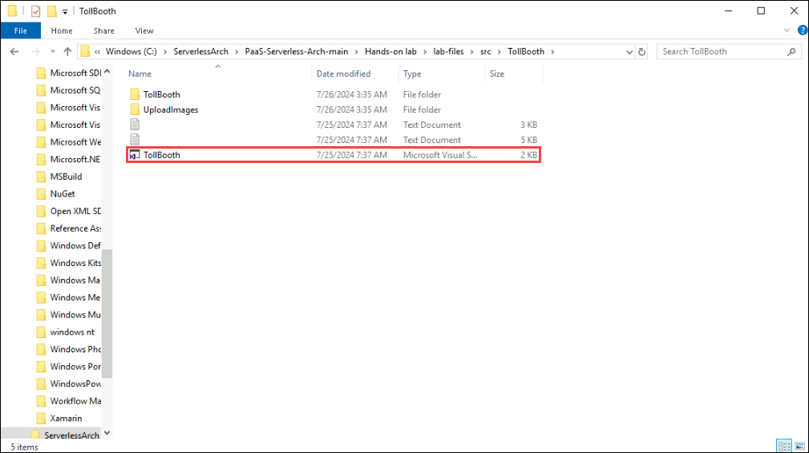

1. If prompted about how to open the file, select **Visual Studio 2022**, and then select **OK**.

   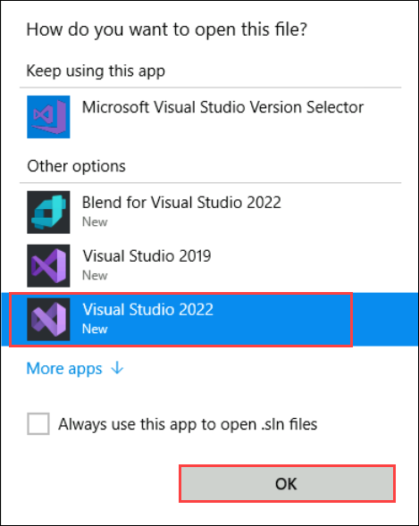

1. Click on the **Sign in** button and paste your Azure account credentials given below:

   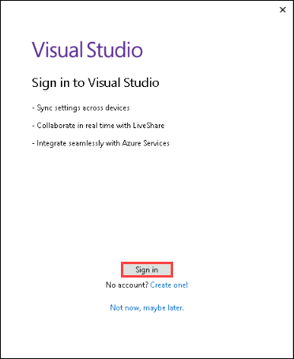

1. Select **Work or school account** and click on **Continue**.

   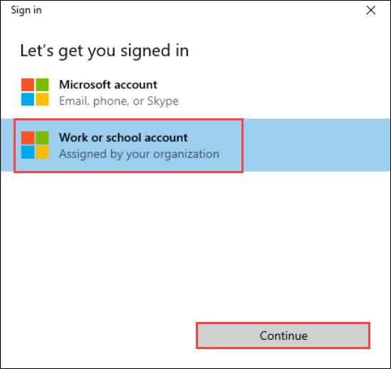

   - Username: **<inject key="AzureAdUserEmail" />** and click on **Next**.

     

   - Password: **<inject key="AzureAdUserPassword" />** and click on **Sign in**.

     

1. In the **Stay signed in to all your apps** page, uncheck the box for **Allow my organization to manage my device** and click on **No, sign in to this app only**.

   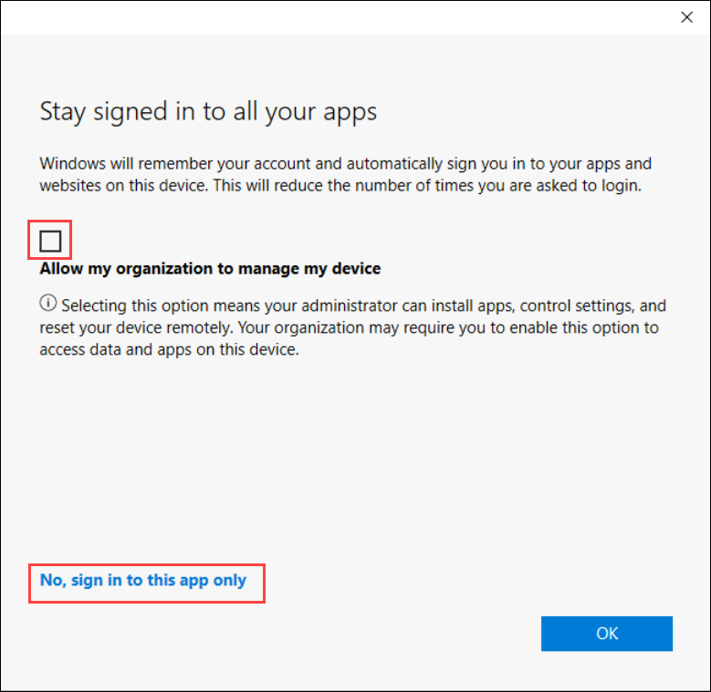

1. After signing in you will be prompted to choose environment settings, click on **Blue** colour theme for better visibility, and click on **Start Visual Studio**.
    
   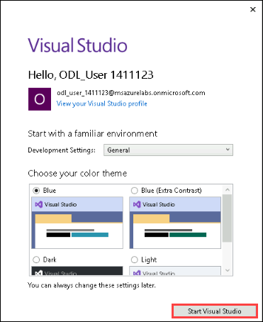

1. If prompted with a security warning, uncheck **Ask me for every project in this solution**, and then select **OK**.

1. Notice the solution contains the following projects:

   - `TollBooth`
   - `UploadImages`

   > **Note**: The UploadImages project is used for uploading a handful of car photos for testing the scalability of the serverless architecture.

   

1. Return to the open File Explorer window and navigate back `C:\ServerlessArch\PaaS-Serverless-Arch-main\Hands-on lab\lab-files\src\license plates`. It contains sample license plate photos used for testing out the solution. Some of the images is guaranteed to fail OCR processing, which is meant to show how the workload is designed to handle such failures. The UploadImages project uses the **copyfrom** folder as a basis for the 1,000-photo upload option for testing scalability.

   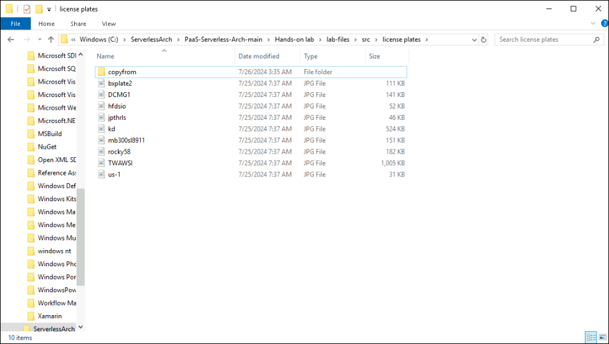

## Task 2: Finish the ProcessImage function

A few components within the starter project must be completed, which are marked as `TODO` in the code. The first set of `TODO` items we address are in the `ProcessImage` function. You will update the `FindLicensePlateText` class that calls the Computer Vision service and the `SendToEventGrid` class, which is responsible for sending processing results to the Event Grid topic you created earlier.

> **Note**: **Do not** update the version of any NuGet package. This solution is built to function with the NuGet package versions currently defined within. Updating these packages to newer versions could cause unexpected results.

1. From the Visual Studio **View** menu, select **Task List**.

    

1. In the Visual Studio Solution Explorer, expand the **TollBooth** project and double-click `ProcessImage.cs` to open the file.

    > Notice the Run method is decorated with the **FunctionName** attribute, which sets the name of the Azure Function to `ProcessImage`. This is triggered by HTTP requests sent to it from the Event Grid service. You tell Event Grid that you want to get these notifications at your function's URL by creating an event subscription, which you will do in a later task, in which you subscribe to blob-created events. The function's trigger watches for new blobs being added to the images container of the data lake storage account that was created by the ARM template in the Before the hands-on lab guide. The data passed to the function from the Event Grid notification includes the URL of the blob. That URL is, in turn, passed to the input binding to obtain the uploaded image from data lake storage.

    

1. There, you will see a list of `TODO` tasks, where each task represents one line of code that needs to be completed.

    

    > **Note**: If the TODO ordering is out of order, select **Description** to sort it in a logical order.
    
    > **Note**: It may take upto 5 minutes to render all the tasks.

1. In the **Task List** pane at the bottom of the Visual Studio window, double-click the `TODO 1` item, which will take you to the first `TODO` task.

    

1. Update the code on the line below the `TODO 1` comment, using the following code:

    ```csharp
    // TODO 1: Set the licensePlateText value by awaiting a new FindLicensePlateText.GetLicensePlate method.
    licensePlateText = await new FindLicensePlateText(log, _client).GetLicensePlate(licensePlateImage);
    ```

1. Double-click `TODO 2` in the Task List to open the `FindLicensePlateText.cs` file.

    > This class is responsible for contacting the Computer Vision service's Read API to find and extract the license plate text from the photo using OCR. Notice that this class also shows how you can implement a resilience pattern using [Polly](https://github.com/App-vNext/Polly), an open-source .NET library that helps you handle transient errors. This is useful for ensuring that you do not overload downstream services, in this case, the Computer Vision service. This will be demonstrated later when visualizing the Function's scalability.

    

1. The following code represents the completed task in FindLicensePlateText.cs:

    ```csharp
    // TODO 2: Populate the below two variables with the correct AppSettings properties.
    var uriBase = Environment.GetEnvironmentVariable("computerVisionApiUrl");
    var apiKey = Environment.GetEnvironmentVariable("computerVisionApiKey");
    ```

1. Double-click `TODO 3` in the Task List to open `SendToEventGrid.cs`.

    > This class is responsible for sending an Event to the Event Grid topic, including the event type and license plate data. Event listeners will use the event type to filter and act on the events they need to process. Please make a note of the event types defined here (the first parameter passed into the Send method), as they will be used later when creating new functions in the second Function App you provisioned earlier.

    

1. Use the following code to complete `TODO 3` in `SendToEventGrid.cs`:

    ```csharp
    // TODO 3: Modify send method to include the proper eventType name value for saving plate data.
    await Send("savePlateData", "TollBooth/CustomerService", data);
    ```

1. `TODO 4` is  a few lines down from step 9 in the `else` block in `SendLicensePlateData(LicensePlateData data)`.  Use the following code to complete `TODO 4` in `SendToEventGrid.cs`:

    ```csharp
    // TODO 4: Modify send method to include the proper eventType name value for queuing plate for manual review.
    await Send("queuePlateForManualCheckup", "TollBooth/CustomerService", data);
    ```

## Task 3: Publish the Function App from Visual Studio

In this task, you will publish the Function App from the starter project in Visual Studio to the existing Function App you provisioned in Azure.

1. Navigate to the **TollBooth** project using the Solution Explorer of Visual Studio.

1. Right-click the **TollBooth** project and select **Publish** from the context menu.

    

1. In the Publish window, select **Azure** **(1)**, then select **Next** **(2)**.

    

1. Select **Azure Function App (Windows)** **(1)** for the specific target, then select **Next** **(2)**.

    

1. In the **Publish** dialog:

    - Select your **Subscription** (1).
    - In the **Function Apps** box (2), expand your **hands-on-lab-<inject key="DeploymentID" enableCopy="false" />** resource group. Select the Function App **TollBoothFunctions-<inject key="DeploymentID" enableCopy="false" />**.
    - **Uncheck the `Run from package file` option** (3).

    

    > **Important**: We do not want to run from a package file because when we deploy from GitHub later on, the build process will be skipped if the Function App is configured for a zip deployment.

1. Select **Finish**.  This creates an Azure Function App publish XML file with a `.pubxml` extension.

1. Click on **Close** in **Public profile creation progress** page.

   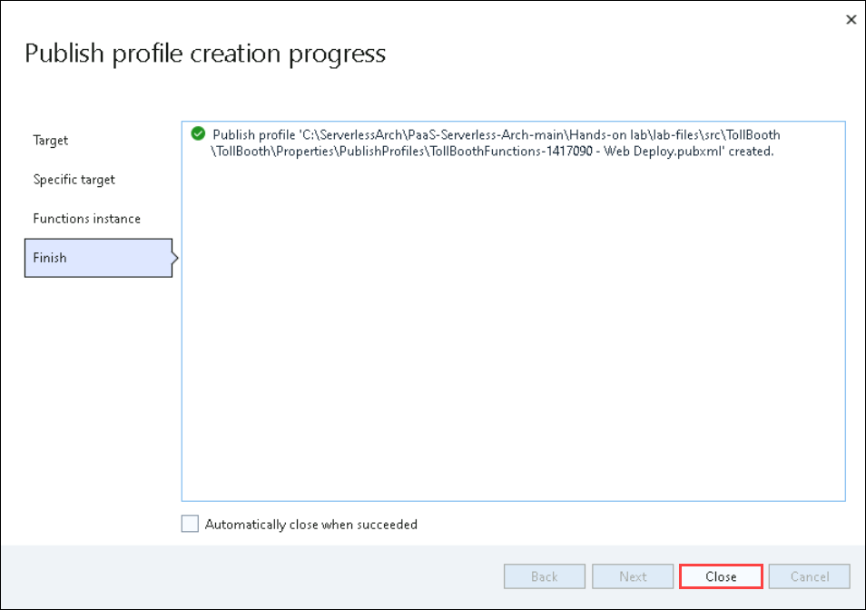

1. Select **Publish** to start the process. Watch the Output window in Visual Studio as the Function App publishes. When it is finished, you should see a message that says, `========== Publish: 1 succeeded, 0 failed, 0 skipped ==========`.

    > **Note**: If prompted to update the version of the function on Azure, select **Yes**.

    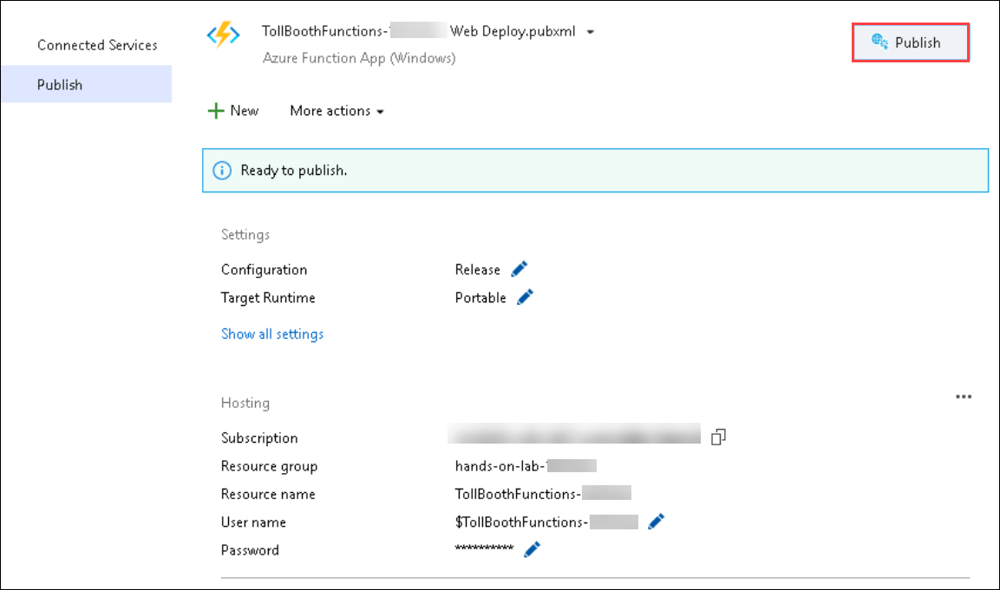

1. Navigate to home page and double click on the **Azure Portal** icon.

    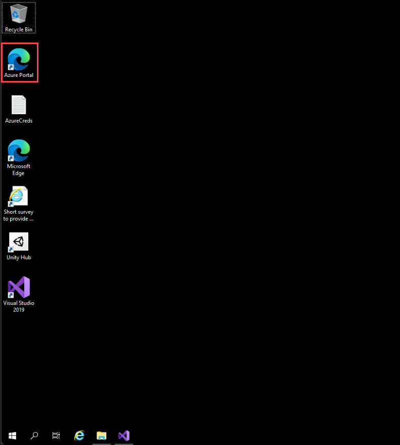

1. On the **Sign into Microsoft Azure** tab you will see the login screen, in that enter the following email/username and then click on **Next**. 
   * Email/Username: <inject key="AzureAdUserEmail"></inject>
   
   
     
1. Now enter the following password and click on **Sign in**.
   * Password: <inject key="AzureAdUserPassword"></inject>
   
     
     
   > If you see the **Help us protect your account** dialog box, then select the **Skip for now** option.

     
  
1. If you see the pop-up **Stay Signed in?**, click No

1. If you see the pop-up **You have free Azure Advisor recommendations!**, close the window to continue the lab.

1. If a **Welcome to Microsoft Azure** popup window appears, click **Maybe Later** to skip the tour.
   
1. Now you will see the Azure Portal Dashboard, click on **Resource groups** from the Navigate panel to see the resource groups.

   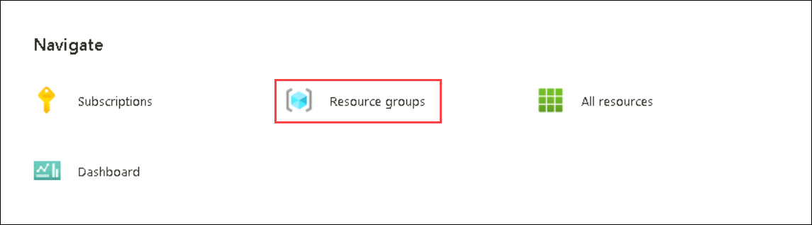
   
1. Now, click on the **Next** from the lower right corner to move to the next page.

1. Open the **hands-on-lab-<inject key="DeploymentID" enableCopy="false" />** resource group, then select the **TollBoothFunctions-<inject key="DeploymentID" enableCopy="false" />** Azure Function App, to which you just published.

   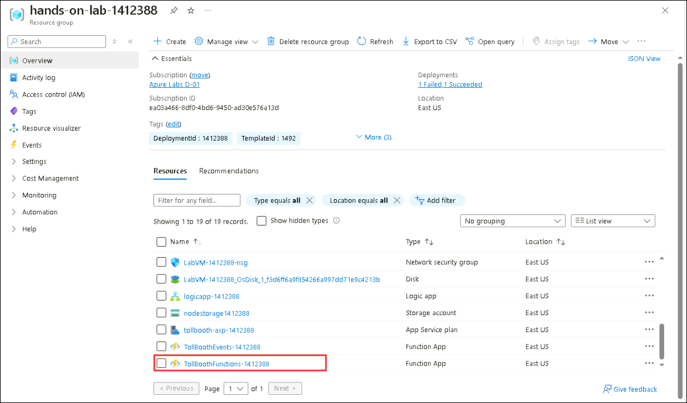

1. Scroll down to functions tab. You should see both functions you just published from the Visual Studio solution listed. Click on **ProcessImage** function.

   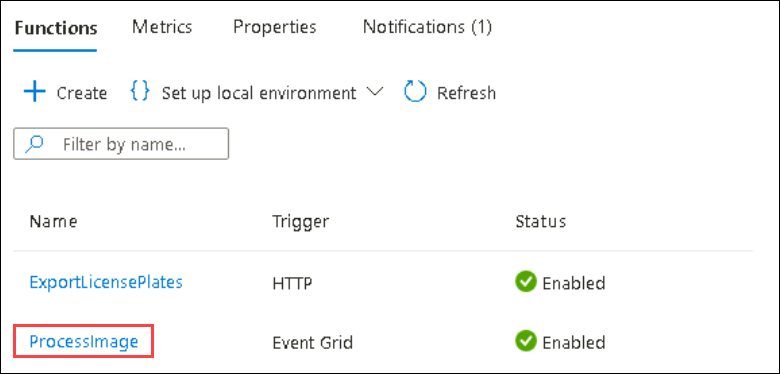

1. In the **ProcessImage | Code + Test** page navigate to **Integration (1)** tab. In the integration tab click on **Event Grid Trigger (eventGridEvent) (2)**.

    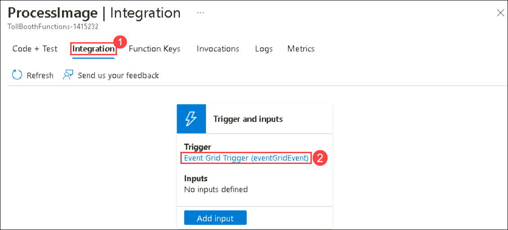

1. In the **Edit Trigger** page, Click on **Create Event Grid subscription**.

    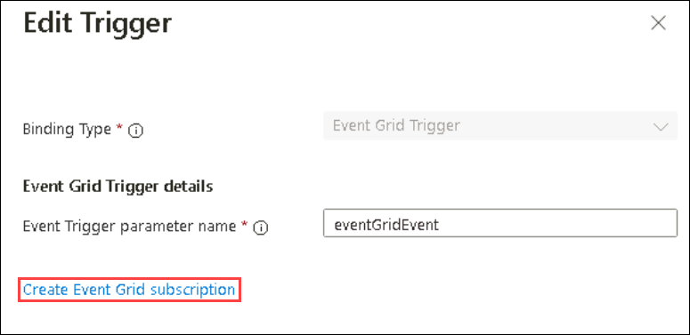

1. On the **Create Event Subscription** blade, specify the following configuration options and click on **Create** **(8)**.

    - **Name**: **Name**: Enter **processimagesub** **(1)** (ensure the green check mark appears).
    - **Event Schema**: Select **Event Grid Schema** **(2)**.
    - **Topic Type**: Select **Storage Accounts (Blob & GPv2)** **(3)**.
    - **Subscription**: Select the subscription you are using for this hands-on lab.
    - **Resource Group**: Select the **hands-on-lab-<inject key="DeploymentID" />** resource group from the list of existing resource groups.
    - **Resource**: Select your data lake storage account **datalake<inject key="DeploymentID" />** **(4)**.
    - **System Topic Name**: Enter **processimagesubtopic** **(5)**
    - **Filter to Event Types**: Select only the **Blob Created** **(6)** from the event types dropdown list .
    - **Endpoint Type**: Leave **Azure Function** **(7)** as the Endpoint Type.
    - **Endpoint**: Leave as **ProcessImage** **(7)**.

    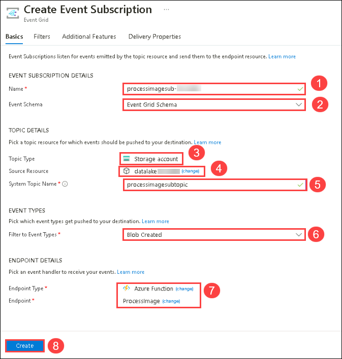

  > **Congratulations** on completing the task! Now, it's time to validate it. Here are the steps:
	
  - Hit the Validate button for the corresponding task. If you receive a success message, you can proceed to the next task. 
  - If not, carefully read the error message and retry the step, following the instructions in the lab guide.
  - If you need any assistance, please contact us at labs-support@spektrasystems.com. We are available 24/7 to help you out.

   <validation step="4494ee7a-fc63-44ff-912e-eae19f9b4046" />

### Summary

In this exercise, you updated code file, published the functions to Azure, and added an event grid trigger to initiate a trigger when images are published to blob storage.

## You have successfully completed the Lab!
