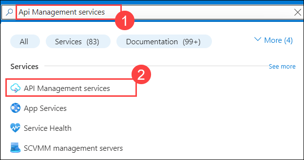
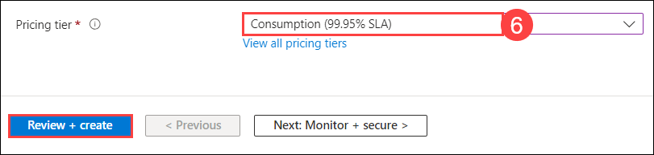
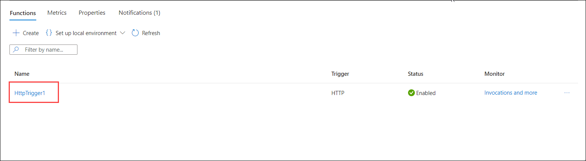
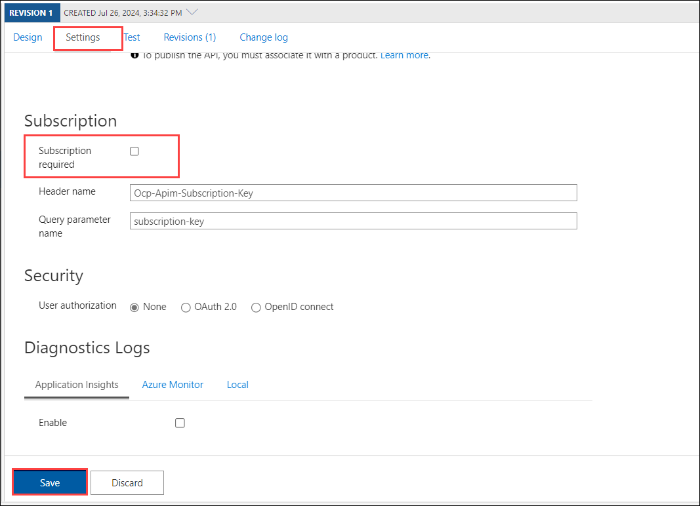
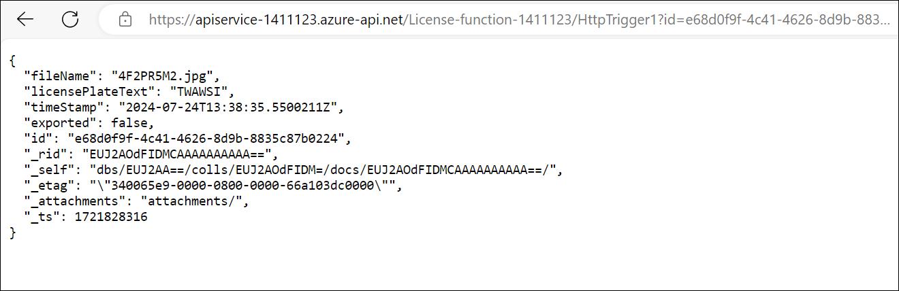

# Exercise:3 Integrate API Management with Your Azure Functions

## Task 1: Create an API Management instance 

In this task, you will create an API Management instance in Azure. API Management is a service that acts as a gateway between backend services and client applications, allowing for centralized management, security, and monitoring of APIs.

1. On the **Azure Portal**, in the **Search resources, services, and docs (G+/) box** at the top of the portal, enter **API Management services (1)**, and then select **API Management services (2)** under **Services**.

    

1. Click on **Create**.

    

1. On the **Basics** tab of the **Create API Management Service** page, fill in the necessary details, Ensure all required fields are completed accurately, then click on **Review + create** to proceed.

   | Setting         | Value |
   ------------------|---------
   | **Subscription** | Keep it as default (1)|
   | **Resource group**| hands-on-lab-<inject key="DeploymentID"></inject> (2)|
   | **Resource name** | apiservice-<inject key="DeploymentID"></inject> (3)|
   | **Organization name** | contoso- (4)|
   | **Administrator email** | <inject key="AzureAdUserEmail"></inject> (5)|
   | **Pricing tier** | Consumption (6)|

    

    

1. Review your configuration to ensure all settings are correct, then click on **Create** to initiate the deployment process.

    

## Task 2: Create a function to pull driver's license information 

In this task, you will go through creating an Azure Function App and connecting it to an Azure Cosmos DB. You will create an HTTP-triggered function within the Function App and replace its default code with JavaScript to query Cosmos DB. Additionally, you'll configure environment variables for Cosmos DB connection details to ensure secure and efficient access to the database from the function.

1. In the search bar of the Azure Portal, type **Function app (1)** and select **Function App (2)** from the search results.

    

1. Click on **+ Create** to initiate the creation of a new Function App.

    

1. From the **Create Function App** tab, select **Consumption** as the hosting plan and then click on **Next** to proceed.

    

1. On the **Basics** tab of the **Create Function App** page, provide the details as mentioned in the table below. After filling in the necessary information, click on **Review + create** at the bottom of the page, and then click on **Create** to start the deployment.

    | Setting | Action |
    | -- | -- |
    | **Subscription** | Keep it as default |
    | **Resource Group** | hands-on-lab-<inject key="DeploymentID"></inject> (2) |
    | **Function App name** | **License-function-<inject key="DeploymentID"></inject>** (3) |
    | **Runtime stack** | **Node.js** (4) |
    | **Operating System** | **Windows** (5) |

    

     > **Note:** Keep the rest of the options as default.
 
Once the deployment is completed, click on **Go to resource** to access the newly created Function App.

1. On the **Overview** (1) page of the **Function app**, go to the **Functions** tab and click **Create function** (2). On the **Create function** page, search for and select **HTTP trigger** (3), then click **Next** (4).

    

1. On the **Template details** page, leave the default options as they are and click on **Create**.

    

1. You will see that a function with the specified name has been created successfully.

    

1. In the search bar of the Azure Portal, search for **Cosmos DB** (1) and select **Azure Cosmos DB** (2).

    

1. Select your **cosmosdb-<inject key="DeploymentID"></inject>** account.

1. Click on **Keys** (2) under **Settings** (1) and copy the **URI** (3) (Endpoint). Then, click on the **eye** (4) icon to reveal and copy your **PRIMARY KEY** (5). Note down both the URI and PRIMARY KEY.

    

1. Click on the **Data Explorer** (1), note down `databaseId` which is **LicensePlates** (2) and `containerId` which is **Processed** (3).

    

1. Navigate back to your **HttpTrigger** function within the function app named **License-function-<inject key="DeploymentID"></inject>**.

1. On the **HttpTrigger1** Function blade, select **Code + Test** and replace the existing code in the `index.js` file with the following:

    ```
    const { CosmosClient } = require("@azure/cosmos");

    const endpoint = process.env.COSMOS_DB_ENDPOINT;
    const key = process.env.COSMOS_DB_PRIMARY_KEY;
    const databaseId = process.env.COSMOS_DB_DATABASE_ID;
    const containerId = process.env.COSMOS_DB_CONTAINER_ID;

    const client = new CosmosClient({ endpoint, key });

    module.exports = async function (context, req) {
        context.log('JavaScript HTTP trigger function processed a request.');

        const id = req.query.id || (req.body && req.body.id);

        if (!id) {
            context.res = {
                status: 400,
                body: "Please pass a driver license id on the query string or in the request body"
            };
            return;
        }

        context.log('Querying item with ID:', id);

        try {
            const database = client.database(databaseId);
            const container = database.container(containerId);

            // Use the `query` method to search for items if `id` is not the partition key
            const { resources: items } = await container.items
                .query({ query: 'SELECT * FROM c WHERE c.id = @id', parameters: [{ name: '@id', value: id }] })
                .fetchAll();

            if (items.length > 0) {
                context.res = {
                    status: 200,
                    body: items[0]
                };
            } else {
                context.res = {
                    status: 404,
                    body: "Driver's license not found"
                };
            }
        } catch (err) {
            context.log.error("Error fetching data from Cosmos DB:", err);
            context.res = {
                status: 500,
                body: "Error fetching data from Cosmos DB"
            };
        }
    };

    ```

1. In the **Settings** section (1) of your function app, navigate to **Environment variables** (2). Click on the **+ ADD** button to begin adding new environment variables.

    

1. In the **Environment variables** section, add the following values:

   - **COSMOS_DB_ENDPOINT**: Your Cosmos DB URI
   - **COSMOS_DB_PRIMARY_KEY**: Your Cosmos DB primary key
   - **COSMOS_DB_DATABASE_ID**: The Name of your Cosmos DB database
   - **COSMOS_DB_CONTAINER_ID**: The Name of your Cosmos DB container

1. In the **Environment variables** section, add **COSMOS_DB_ENDPOINT** (1) as the **Name** and paste the copied **Value** (2) (the URI of your Cosmos DB) into the appropriate field. Click **Apply** to save the changes.

    

    >**Note**: Ensure that you add all required values for **Environment variables**, including `COSMOS_DB_ENDPOINT`, `COSMOS_DB_PRIMARY_KEY`, `COSMOS_DB_DATABASE_ID`, and `COSMOS_DB_CONTAINER_ID`.

1. After adding all the required values, click on **Apply** to save the changes. Then, click on **Confirm** to finalize and ensure that your environment variables are updated successfully.

    

    

## Task 3: Import your Function App into API Management

1. On the **Azure Portal**, in the **Search resources, services, and docs (G+/) box** at the top of the portal, enter **API Management services (1)**, and then select **API Management services (2)** under **Services**.

    

1. Select the API Management service named **apiservice-<inject key="DeploymentID"></inject>**.

1. Click on **Console** (1) under **Development Tools** and run the command to install the Azure Cosmos DB SDK.

    ```
    npm install @azure/cosmos
    ```

    

1. In the **APIs** (1) section of your Azure API Management service, click on **APIs** (2) to open the list of available APIs. Then, select **Function App** (3) from the list of available API types. This will allow you to manage and configure your Function App API within the API Management service.

    

1. On the **Create from Function App** page, click on the **Browse** option. This will allow you to view and select the available Function Apps that you can integrate with your API Management service.

    

1. On the **Import Azure Functions** page, click on the **Select** button. This will confirm your choice and initiate the process of importing the selected Azure Functions into your API Management service.

    

1. Click on **License-function-<inject key="DeploymentID"></inject>** and then click **Select** to choose the Azure Function App.

    

1. Click on **Select** to add your **HttpTrigger1** function, configuring it for both GET and POST methods.

    

1. It will fetch all the details for the function app; click on **Create** to finalize the process.

    

1. Here, the Function App is added successfully, and you will see that the **GET** and **POST** operations of the **HttpTrigger1** functions are included.

    

## Task 4: Secure the API with API Management (e.g., API keys, OAuth 2.0)

In Progress 

## Task 5: Configure API policies (e.g., rate limiting, logging) 

In Progress 

## Task 6: Test the API through the APIM Developer Portal

1. In the Azure Portal's search bar, type **Cosmos DB** (1) and select **Azure Cosmos DB** (2) from the search results.

    

1. Select your **cosmosdb-<inject key="DeploymentID"></inject>** account.

1. Click on **Data Explorer** (1). Under the **LicensePlates** (2), expand the **Processed** (3) container, select **items** (4), choose an **id** (5) from the list, and copy the **id value**.

    

1. On the **Azure Portal**, in the **Search resources, services, and docs (G+/) box** at the top of the portal, enter **API Management services (1)**, and then select **API Management services (2)** under **Services**.

    

1. Select the API management service named **apiservice-<inject key="DeploymentID"></inject>**.

1. On the APIs page, where the **License-function-<inject key="DeploymentID"></inject>** function has been added, click on **Test** (1).

    

1. On the **Test** page select the **GET HttpTrigger1** (1) and click on the **+ Add parameters** (2).

    

1. Provide the **Name** as **id** and enter the corresponding **Value** that you copied from the items in the **Processed** container in Cosmos DB. Click on **Send**.

    

1. After sending the GET request, it will fetch and display all the details related to the LicensePlate.

    

1. Copy the **Request URL** provided in the API test section and open it in a new browser tab to test the API endpoint.

    

1. If access is denied due to the missing subscription key, ensure you have removed the subscription key requirement correctly from the **Settings**. If the issue persists, verify that the changes have been saved and applied. 

    

1. To proceed, you need to remove the subscription key requirement from the settings. Click on **Settings**, uncheck **Subscription required**, and then click **Save**.

    

1. Refresh the page, and you will find the details of the fetched data for **LicensePlate**.

    
