# Exercise 3: Integrate API Management with your Azure Functions

**Estimated Duration**: 45 minutes

Here you use the Azure API Management (APIM) which is a powerful service for creating, securing, and managing APIs. It offers features like authentication, rate limiting, and IP filtering to ensure robust security and performance. APIM also provides developer portals for easy API documentation and testing, facilitating seamless integration for developers.

In this exercise, you'll integrate Azure API Management (APIM) with your Azure Functions to create a secure and manageable API. Specifically, you'll develop a function to retrieve driver license details and import this function into an APIM instance. Once imported, you'll expose this functionality as an API, securing it with a subscription key to control access. Additionally, you'll enhance security by configuring an IP filtering policy, ensuring that only authorized IP addresses can access the API. This setup demonstrates how to effectively manage and secure APIs using Azure's comprehensive API Management features.

## Lab objectives

You will be able to complete the following tasks:

- Task 1: Create a function to pull driver's license information
- Task 2: Import your Function App into API Management
- Task 3: Secure the API using Subscription Key and validate
- Task 4: Configure API policies (IP Filtering) and validate

## Help references

|                  |          |
| ---------------- | -------- |
| **Description**  | **Link** |
| Import and publish your first API | <https://learn.microsoft.com/en-us/azure/api-management/import-and-publish> |

## Task 1: Create a function to pull driver's license information 

In this task, you will go through creating an Azure Function App and connecting it to an Azure Cosmos DB. You will create an HTTP-triggered function within the Function App and replace its default code with JavaScript to query Cosmos DB. Additionally, you'll configure environment variables for Cosmos DB connection details to ensure secure and efficient access to the database from the function.

1. In the search bar of the Azure Portal, type **Function app (1)** and select **Function App (2)** from the search results.

   

1. Click on **+ Create** to initiate the creation of a new Function App.

   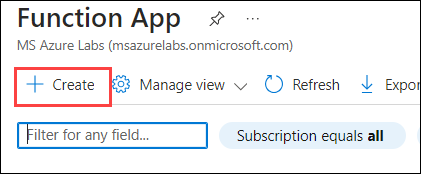

1. From the **Create Function App** tab, select **Consumption** as the hosting plan and then click on **Next** to proceed.

   

1. On the **Basics** tab of the **Create Function App** page, provide the details as mentioned in the table below. After filling in the necessary information, click on **Review + create** at the bottom of the page, and then click on **Create** to start the deployment.

   | Setting | Action |
   | -- | -- |
   | **Subscription** | Keep it as default |
   | **Resource Group** | hands-on-lab-<inject key="DeploymentID"></inject> (2) |
   | **Function App name** | **License-function-<inject key="DeploymentID" enableCopy="false" />** (3) |
   | **Runtime stack** | **Node.js** (4) |
   | **Operating System** | **Windows** (5) |

   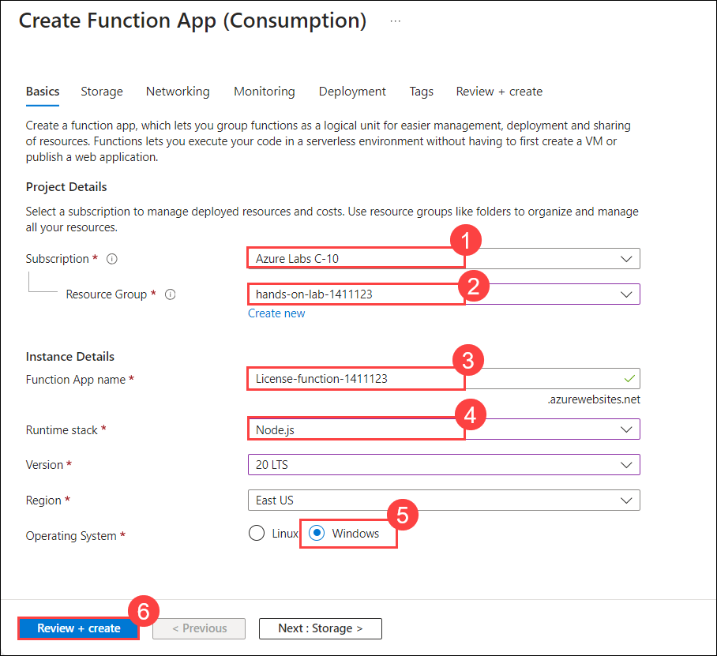

   > **Note:** Keep the rest of the options as default.
 
1. Once the deployment is completed, click on **Go to resource** to access the newly created Function App.

1. On the **Overview** (1) page of the **Function app**, go to the **Functions** tab and click **Create function** (2). On the **Create function** page, search for and select **HTTP trigger** (3), then click **Next** (4).

   

1. On the **Template details** page, leave the default options as they are and click on **Create**.

   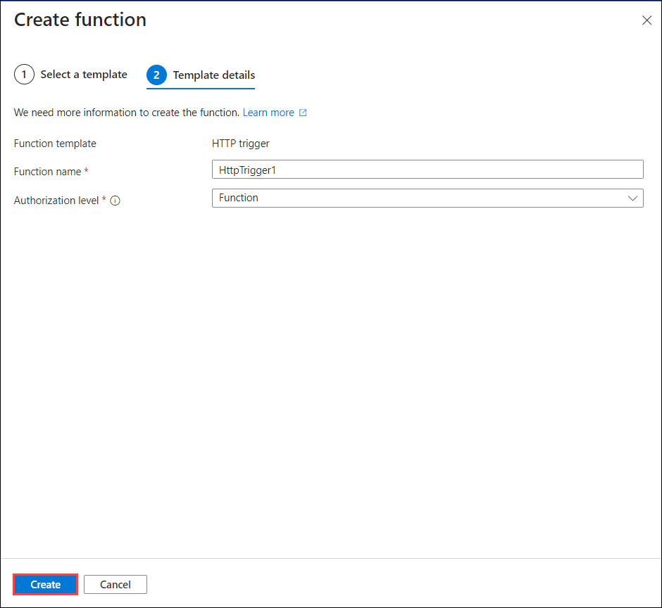

1. On the  **Code + Test** pane, replace the existing code in the `index.js` file with the following:

   ```
   const { CosmosClient } = require("@azure/cosmos");

   const endpoint = process.env.COSMOS_DB_ENDPOINT;
   const key = process.env.COSMOS_DB_PRIMARY_KEY;
   const databaseId = process.env.COSMOS_DB_DATABASE_ID;
   const containerId = process.env.COSMOS_DB_CONTAINER_ID;

   const client = new CosmosClient({ endpoint, key });

   module.exports = async function (context, req) {
       context.log('JavaScript HTTP trigger function processed a request.');

       const id = req.query.id || (req.body && req.body.id);

       if (!id) {
           context.res = {
               status: 400,
               body: "Please pass a driver license id on the query string or in the request body"
           };
           return;
       }

       context.log('Querying item with ID:', id);

       try {
           const database = client.database(databaseId);
           const container = database.container(containerId);

           // Use the `query` method to search for items if `id` is not the partition key
           const { resources: items } = await container.items
               .query({ query: 'SELECT * FROM c WHERE c.id = @id', parameters: [{ name: '@id', value: id }] })
               .fetchAll();

           if (items.length > 0) {
               context.res = {
                   status: 200,
                   body: items[0]
               };
           } else {
               context.res = {
                   status: 404,
                   body: "Driver's license not found"
               };
           }
       } catch (err) {
           context.log.error("Error fetching data from Cosmos DB:", err);
           context.res = {
               status: 500,
               body: "Error fetching data from Cosmos DB"
           };
       }
   };

   ```
   >**Note**: You can see some of the variables are used in the code such as `COSMOS_DB_ENDPOINT`, `COSMOS_DB_PRIMARY_KEY`, `COSMOS_DB_DATABASE_ID`, and `COSMOS_DB_CONTAINER_ID` you need to add those in **environment variables** which you will be doing in further steps.

1. Click on **save**.

1. In the search bar of the Azure Portal, search for **Cosmos DB** (1) and select **Azure Cosmos DB** (2).

   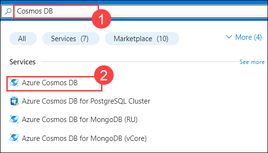

1. Select your **cosmosdb-<inject key="DeploymentID" enableCopy="false" />** account.

1. Click on **Keys** (2) under **Settings** (1) and copy the **URI** (3) (Endpoint). Then, click on the **eye** (4) icon to reveal and copy your **PRIMARY KEY** (5). Note down both the URI and PRIMARY KEY.

   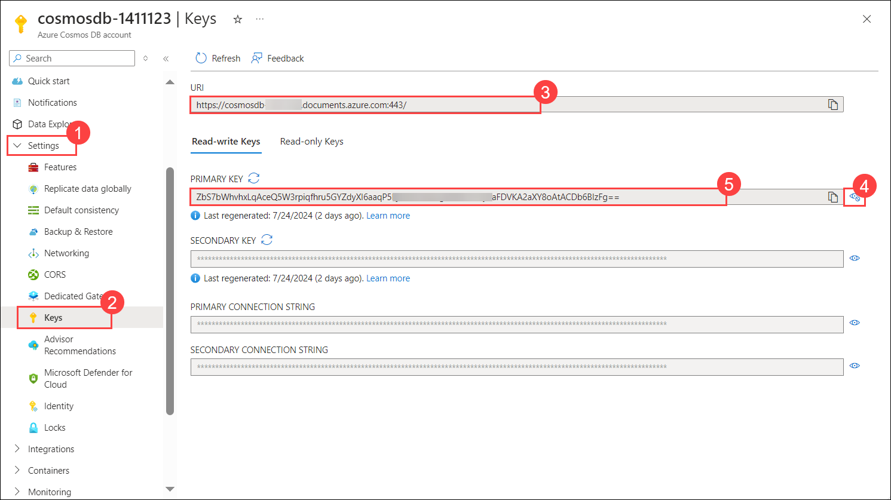

1. Click on the **Data Explorer** (1), note down `databaseId` which is **LicensePlates** (2) and `containerId` which is **Processed** (3).

   

1. Navigate back to your **HttpTrigger** function within the function app named **License-function-<inject key="DeploymentID" enableCopy="false" />**.

1. In the **Settings** section (1) of your function app, navigate to **Environment variables** (2). Click on the **+ ADD** button to begin adding new environment variables.

   

1. In the **Environment variables** section, add the following values:

   - **COSMOS_DB_ENDPOINT**: Your Cosmos DB URI
   - **COSMOS_DB_PRIMARY_KEY**: Your Cosmos DB primary key
   - **COSMOS_DB_DATABASE_ID**: The Name of your Cosmos DB database
   - **COSMOS_DB_CONTAINER_ID**: The Name of your Cosmos DB container

1. In the **Environment variables** section, add **COSMOS_DB_ENDPOINT** (1) as the **Name** and paste the copied **Value** (2) (the URI of your Cosmos DB) into the appropriate field. Click **Apply** to save the changes.

   

   >**Note**: Ensure that you add all required values for **Environment variables**, including `COSMOS_DB_ENDPOINT`, `COSMOS_DB_PRIMARY_KEY`, `COSMOS_DB_DATABASE_ID`, and `COSMOS_DB_CONTAINER_ID`.

1. After adding all the required values, click on **Apply** to save the changes. Then, click on **Confirm** to finalize and ensure that your environment variables are updated successfully.

   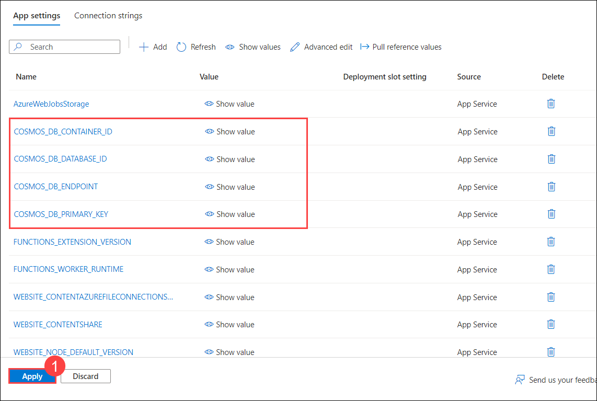

   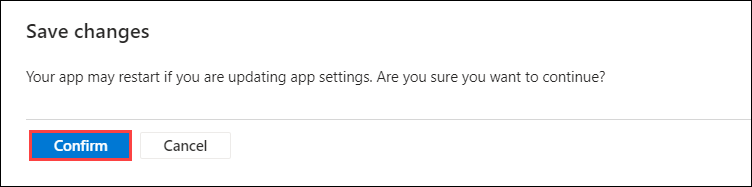

1. Now Click on **Console** (1) under **Development Tools** from the left hand menu and run the command to install the Azure Cosmos DB SDK.

   ```
   npm install @azure/cosmos
   ```

   

  > **Congratulations** on completing the task! Now, it's time to validate it. Here are the steps:
	
  - Hit the Validate button for the corresponding task. If you receive a success message, you can proceed to the next task. 
  - If not, carefully read the error message and retry the step, following the instructions in the lab guide.
  - If you need any assistance, please contact us at labs-support@spektrasystems.com. We are available 24/7 to help you out.

   <validation step="6ba8972b-b250-4400-b6c2-b14bda55802f" />

## Task 2: Import your Function App into API Management

In this task, you will be importing your function into API Management Instance. Which creates an API of your function. 

1. On the **Azure Portal**, in the **Search resources, services, and docs (G+/) box** at the top of the portal, enter **API Management services**, and then select **API Management services** under **Services**.

   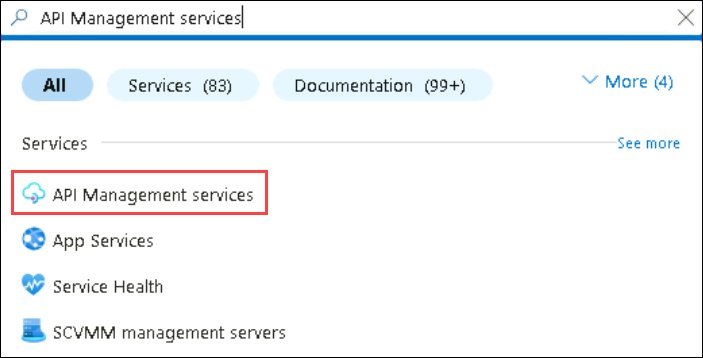

1. Select the API Management service named **apiservice-<inject key="DeploymentID" enableCopy="false" />**.

1. In the **APIs** (1) section of your Azure API Management service, click on **APIs** (2) to open the list of available APIs. Then, select **Function App** (3) from the list of available API types. This will allow you to manage and configure your Function App API within the API Management service.

   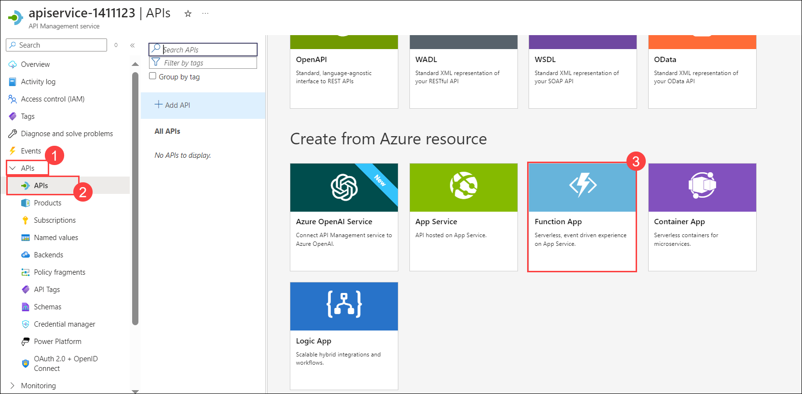

1. On the **Create from Function App** page, click on the **Browse** option. This will allow you to view and select the available Function Apps that you can integrate with your API Management service.

   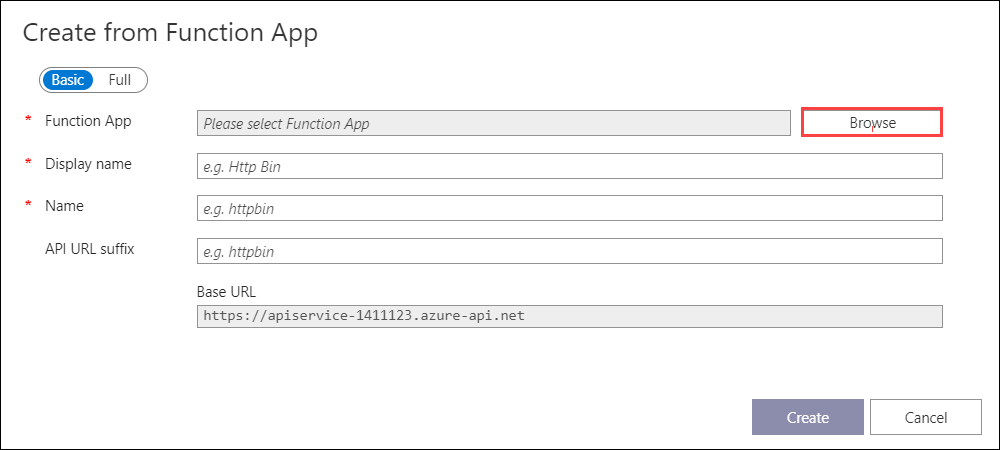

1. On the **Import Azure Functions** page, click on the **Select** button. This will confirm your choice and initiate the process of importing the selected Azure Functions into your API Management service.

   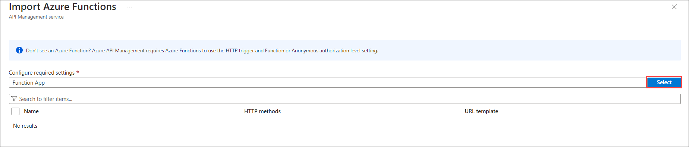

1. Click on **License-function-<inject key="DeploymentID" enableCopy="false" />** and then click **Select** to choose the Azure Function App.

   

1. Click on **Select** to add your **HttpTrigger1** function, configuring it for both GET and POST methods.

   

1. It will fetch all the details for the function app; click on **Create** to finalize the process.

   

1. Here, the Function App is added successfully, and you will see that the **GET** and **POST** operations of the **HttpTrigger1** functions are included.

   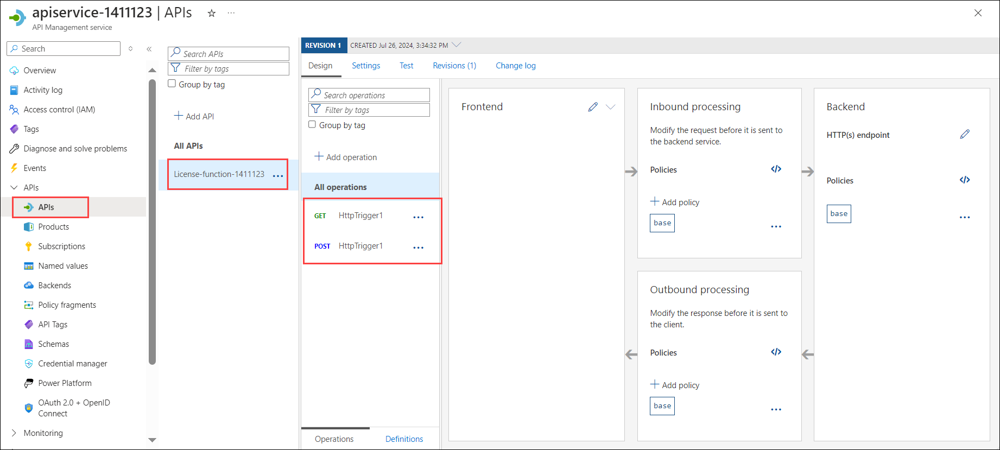

## Task 3: Secure the API using Subscription Key and validate

In this task you will be Securing your API by creating subscription key. which should be used with the request URL to access the API.

1. In the Azure Portal's search bar, type **Cosmos DB** (1) and select **Azure Cosmos DB** (2) from the search results.

   

1. Select your **cosmosdb-<inject key="DeploymentID" enableCopy="false" />** account.

1. Click on **Data Explorer** (1). Under the **LicensePlates** (2), expand the **Processed** (3) container, select **items** (4), choose an **id** (5) from the list, and copy the **id value**.

   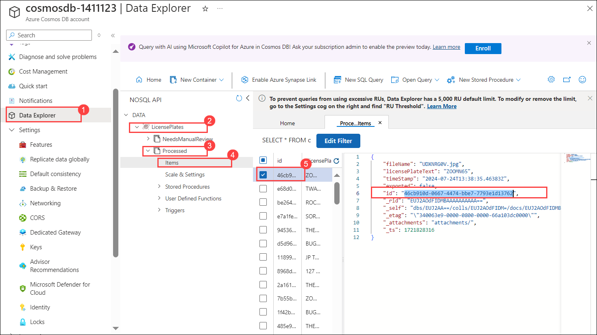

1. On the **Azure Portal**, use the search bar on the top and enter **API Management services**, and then select **API Management services** under **Services**.

   

1. Select the API management service named **apiservice-<inject key="DeploymentID" enableCopy="false" />**.

1. On the APIs page, where the **License-function-<inject key="DeploymentID" enableCopy="false" />** function has been added, click on **Test** (1).

   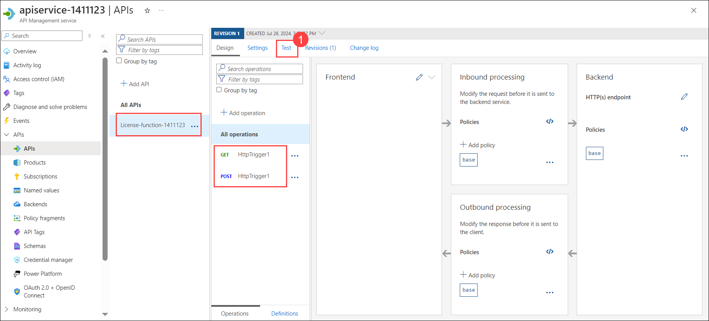

1. On the **Test** page select the **GET HttpTrigger1** (1) and click on the **+ Add parameters** (2).

   

1. Provide the **Name** as **id** and enter the corresponding **Value** that you copied from the items in the **Processed** container in Cosmos DB. Click on **Send**.

   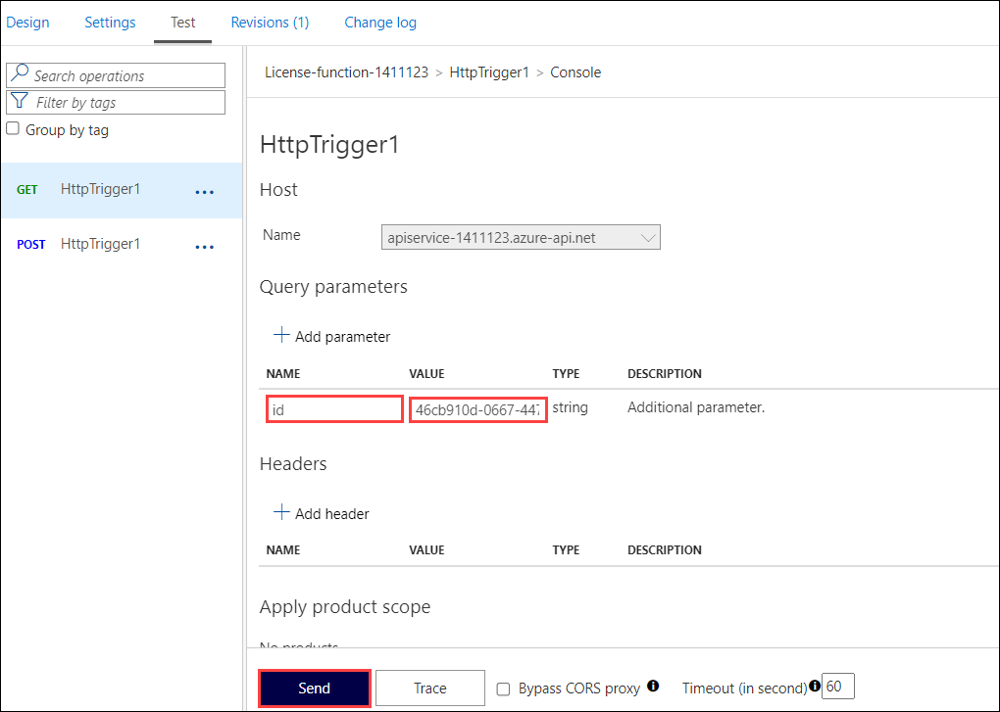

1. After sending the GET request, it will fetch and display all the details related to the LicensePlate.

   

1. Copy the **Request URL** provided in the API test section and open it in a new browser tab to test the API endpoint.

   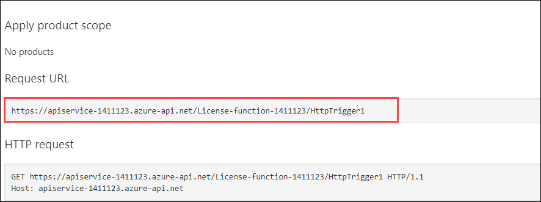

1. You will see **access denied**.This means your API is now secured. Now You need Subscription key to access your API. 

   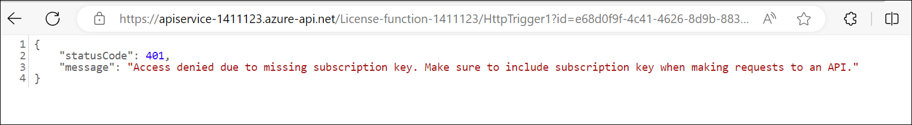

1. Navigate to **Subscription** page from the left hand menu.

   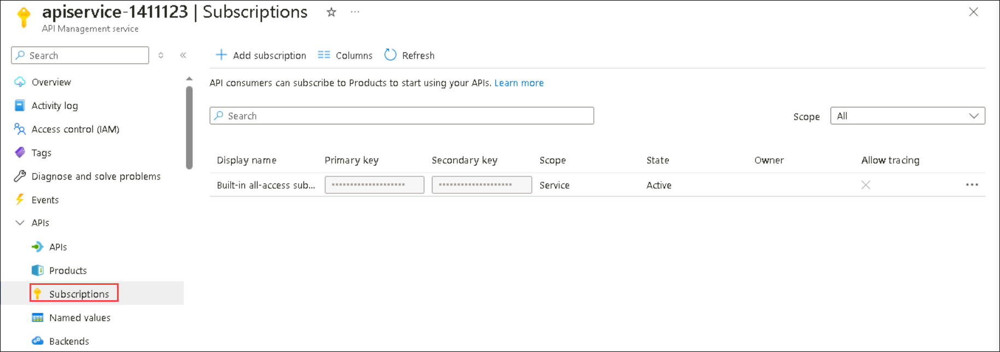

1. You can see a precreated Subscription key called **Built-in all-access subscription**. This is a master key which works for all the API under this particular API Management service.But for now you will create a new subscription key for the API that you created. Click on **+Add subscription**.

   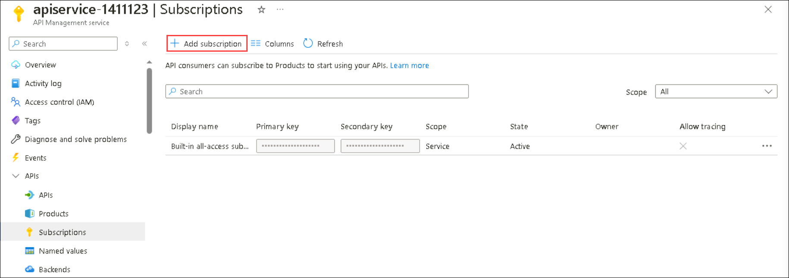

1. On the **New Subscription** form give the **Name(1)** as ```LicenseKeySub``` , Under **scope(2)** select **API** and Under **API(3)** select the API which is already created previously. Click on **Create(4)**.

   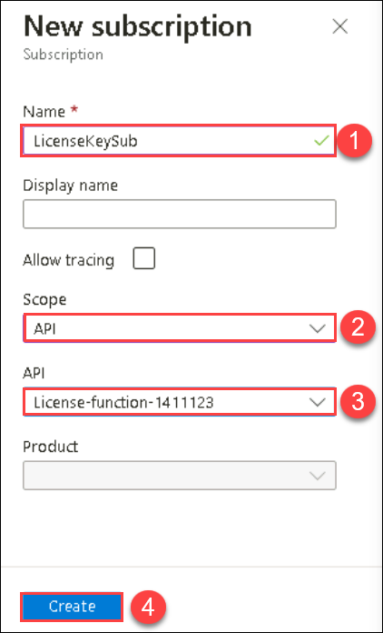

1. Your subscription will be created. You can view its keys by selecting the 3 dots on the rightmost of your subscription name, and choosing Show/hide keys to see the keys.

   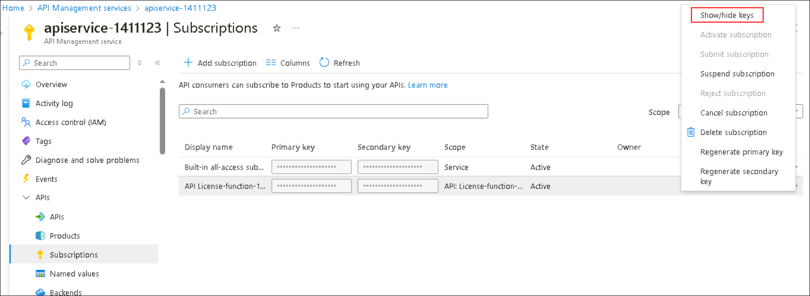

1. Your keys will be visible. Copy the primary key using the Copy button.

   

1. Goto the API Request URL in your browser and add the subscription key in the end, prior to the subscription-key query parameter, joining it with &. This query parameter will store the value of your subscription key, which is needed to access your API successfully.

   Your Request URL will look something like this:

   ```
   https://apiservice-1411123.azure-api.net/License-function-1411123/HttpTrigger1?id=7<ID>&subscription-key=<SUBSCRIPTION-KEY>
   ```
   >**Note**: Make sure to replace the `<ID>` and `<SUBSCRIPTION-KEY>` with the values you copies earlier.

1. You will be able to access your API successfully using the subscription key and the expected response will be displayed.

   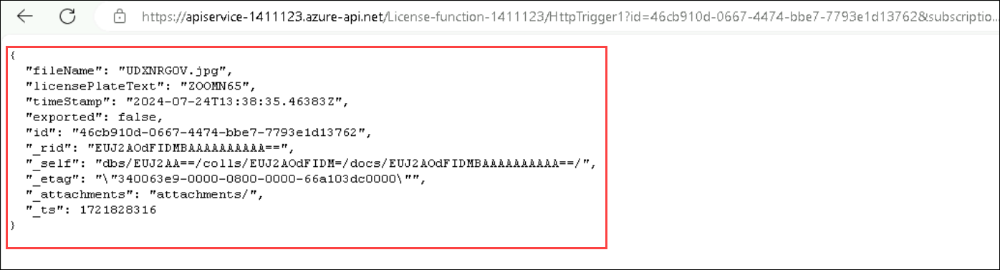

## Task 4: Configure API policies (IP Filtering) and validate

In this task, you will create and use an API Management (APIM) policy for IP filtering. This policy will help you restrict access to your APIs by allowing only specified IP addresses. IP filtering adds an extra layer of security, ensuring that only trusted clients can access your services.

1. On the Azure Portal, use the search bar and search for **Virtual machines**, and then select **Virtual machines** under services.

   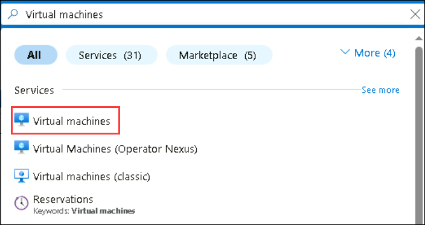

1. Select your **LabVM-<inject key="DeploymentID" enableCopy="false" />**.From the overview page copy the **Public IP** adress and note it down, you will be using this IP in the further steps.

   

1. Use the search bar in the Azure Portal, enter API Management services, and then select API Management services under Services.

   

1. Select your **apiservice-<inject key="DeploymentID" enableCopy="false" />** service.

1. On the APIs page, Select **License-function-<inject key="DeploymentID" enableCopy="false" />** that you have added previously.

   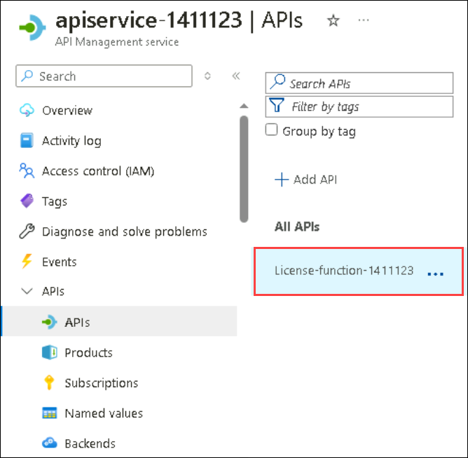

1. On the **Design** pane. Find the **Inbound Processing** box and scroll down, click on **+Add policy**.

   

1. On the **Add inbound policy** page. click on **Filter IP adresses** option.You will be navigated to **Inbound processing** page.

   There are multiple types of policies in API Management Service. Some major types are:

   1. **ip-filter** - it is used to allow or block a particular range of IP adresses.
   2. **rate-limit-by-key** - it is used to set a limit to number of API requests that a client can make.
   3. **validate JWT** - Enforces existence and validity of a JWT extracted from either a specified HTTP header, query parameter, or token value.

   for this task you will be using **ip-filter** policy.

   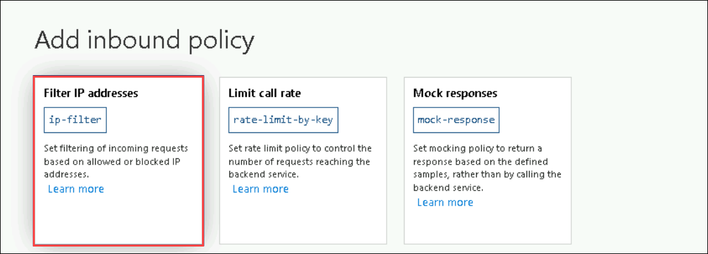

1. Scroll down and change the filtering to **Blocked IPs**(1). and click on **Add IP filter**(2).

   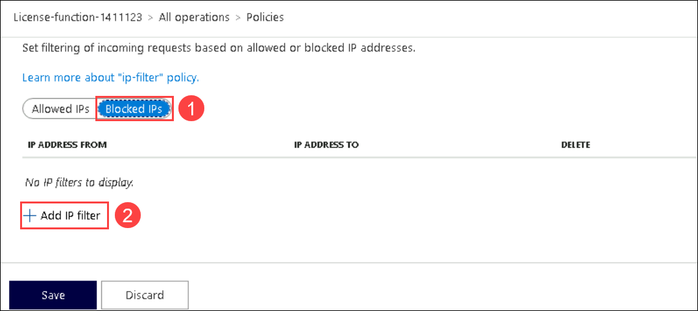

1. Add the IP adress of your **LabVM-<inject key="DeploymentID" enableCopy="false" />**, which you have copied in previously. Click on **save**.

   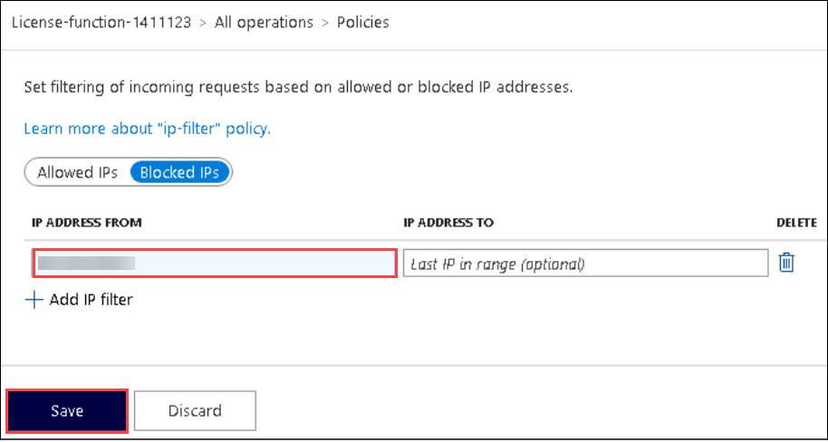

1. Now the policy will be added to your API, which restricts the access to your LabVM. To test this use the request URL which you have used in the previous task.

   Which looks similar to this:

   ```
   https://apiservice-1411123.azure-api.net/License-function-1411123/HttpTrigger1?id=7<ID>&subscription-key=<SUBSCRIPTION-KEY>
   ```
   >**Note**: Make sure to replace the `<ID>` and `<SUBSCRIPTION-KEY>` with the values you copies earlier.

1. Now paste the request URL in the new tab of your browser. You will see **403 Forbidden** error. Which means the policy is attached successfully which is blocking your IP address from accessing the API.

   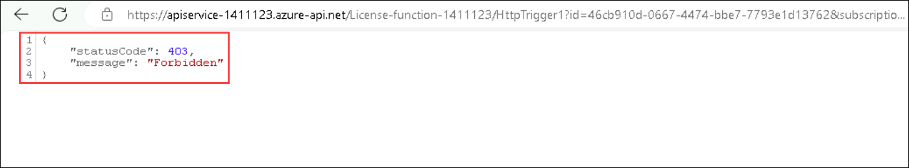

1. Navigate back to your API's design pane and find the policy that you have attached previously in this task.

1. Click on 3 dots which is at the rightmost of your policy name. and click on **delete** to delete the policy.

   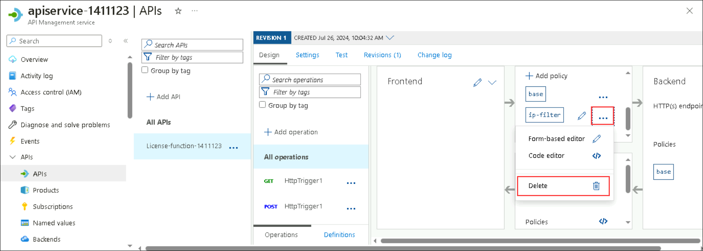

1. Click on **save** after deleting the policy.

   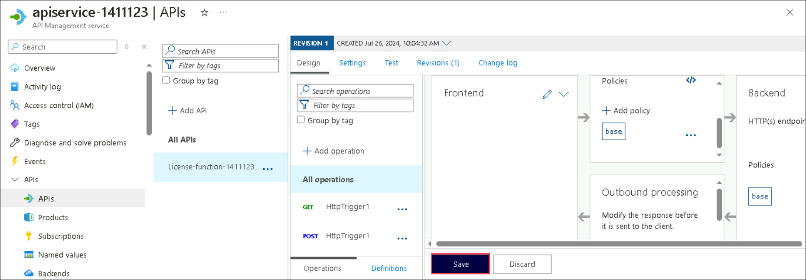

1. Now navigate back to the browser tab where you have pasted the request URL and refresh the page. Now you will be able to get the data successfully withut any error.

   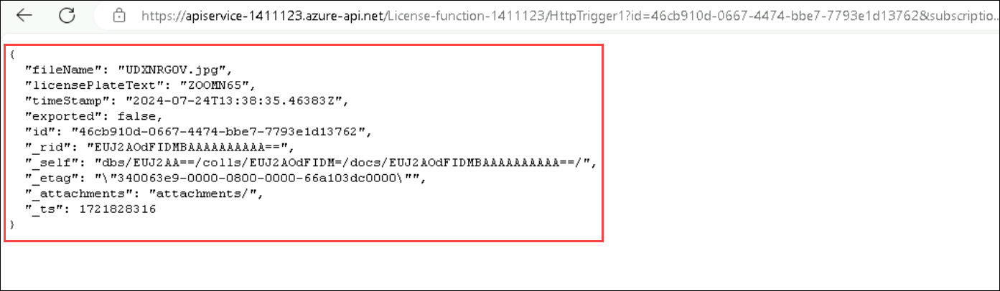

## Summary

In this exercise you have created a new function to pull the driver's license data. and created a API of that function using API Management Service.

## You have successfully completed the Lab!
