# Exercise 6: Create the data export workflow

**Estimated Duration**: 30 minutes

Here you will be using Azure Logic Apps which is a cloud-based service that enables you to automate workflows and integrate various services and applications. It provides a visual designer for building and managing workflows, making it easy to orchestrate complex processes without writing extensive code.

In this exercise, you'll develop a new Logic App to automate your data export workflow. This Logic App will be configured to execute on a scheduled basis, calling the ExportLicensePlates function to retrieve license plate data. The workflow includes a conditional logic step: if the function finds that there are no records to export, the Logic App will automatically send an email notification. This setup ensures that your team stays informed about the status of data exports, even when no new data is available, thereby streamlining communication and operational efficiency.

## Lab objectives

You will be able to complete the following tasks:

- Task 1: Finish ExportLicensePlates function code and publish it to function app
- Task 2: Configure the Logic App to export data
- Task 3: Verify the data export workflow

### Help references

|                 |           |
| --------------- |---------- |
| **Description** | **Links** |
| What is Azure Logic Apps? | <https://docs.microsoft.com/en-us/azure/logic-apps/logic-apps-overview> |
| Call Azure Functions from logic apps | <https://docs.microsoft.com/azure/logic-apps/logic-apps-azure-functions> |

## Task 1: Finish ExportLicensePlates function code and publish it to function app

In this task you will completing the code by performing TODO 5,6,7 steps and publishing it to the function app from visual studio.

1. Return to the LabVM and within Visual Studio navigate to the TollBooth project using the Solution Explorer.

1. From the Visual Studio **View** menu, select **Task List**.

   

1. In the Task List pane at the bottom of the Visual Studio window, double-click the `TODO 5` item, which will take you to the associated `TODO` task.

   

1. In the DatabaseMethods.cs file that is opened, update the code on the line below the `TODO 5` comment, using the following code:

   ```
   // TODO 5: Retrieve a List of LicensePlateDataDocument objects from the collectionLink where the exported value is          false.
   licensePlates = _client.CreateDocumentQuery<LicensePlateDataDocument>(collectionLink,
        new FeedOptions() { EnableCrossPartitionQuery=true,MaxItemCount = 100 })
    .Where(l => l.exported == false)
    .ToList();
   ```

1. Next, return to the `TODO` list and double-click `TODO 6`.

   

1. This is immediately below the `TODO 5` code you just updated. For this one, delete the line of code below the `// TODO 6` comment.

1. Make sure that you deleted the following line under `TODO 6`: `licensePlates = new List<LicensePlateDataDocument>();`.

1. Return to the TODO list and double-click TODO 7.

   

1. In the FileMethods.cs file that is opened, update the code on the line below the TODO 7 comment, using the following code:

   ```
   // TODO 7: Asynchronously upload the blob from the memory stream.
   await blob.UploadFromStreamAsync(stream);
   ```

1. Save all your changes by clicking on **Save all** button in visual studio.

   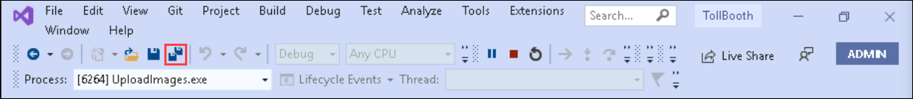

1. Navigate to the TollBooth project using the Solution Explorer of Visual Studio.

1. Right-click the **TollBooth** project and select **Publish** from the context menu.

   

1. Select **Publish** to update your function app with exportLicense function.

   
   
## Task 2: Configure the Logic App to export data

In this task, you will be configuring logic app to export the license plate data to the storage, if there is no data to export then it will send an email to customer service regarding that.

1. In the [Azure portal](https://portal.azure.com), navigate to the **hands-on-lab-<inject key="DeploymentID" enableCopy="false" />** resource group.

  > You can get to the resource group by selecting **Resource groups** under **Azure services** on the Azure portal home page and then select the resource group from the list. If there are many resource groups in your Azure account, you can filter the list for **hands-on-lab** to reduce the resource groups listed.

1. On your resource group blade, select the **logicapp-<inject key="DeploymentID" enableCopy="false" />** Logic App resource in the resource group's list of services available.

1. In the **Logic App Designer** **(1)**, click on **Add a trigger** **(2)**. 

   

1. In the **Add a trigger** page, Search for `Recurrence` **(1)** and select **Recurrence** **(2)**.

   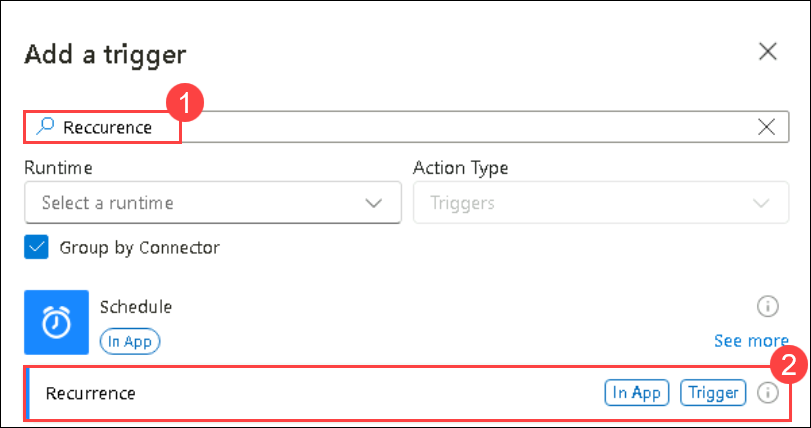

1. Enter **15** into the **Interval** box, and make sure Frequency is set to **Minute**. This can be set to an hour or some other interval, depending on business requirements. and click on **Save**.

   

1. Now in the **Logic App Designer** click on **+** marker and select **Add an action**.

   

1. In the **Add an action** form Enter `Functions` **(1)** in the filter box, then select the **Azure Functions** **(2)**.

   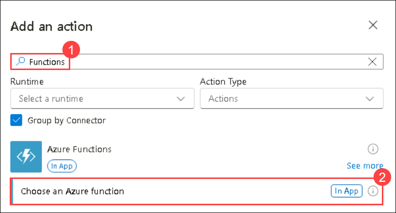

1. Select your **TollBoothFunctions** **(1)** Function App and check the **ExportLicensePlates** **(2)** function as shown. Click on **Add action** **(3)**. 

   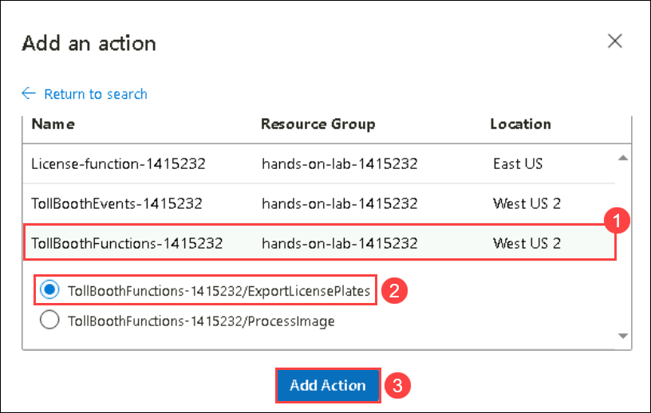

1. On the **Add action** pane, keep everything as default and click on **save** and return to the **Logic App Designer**.

   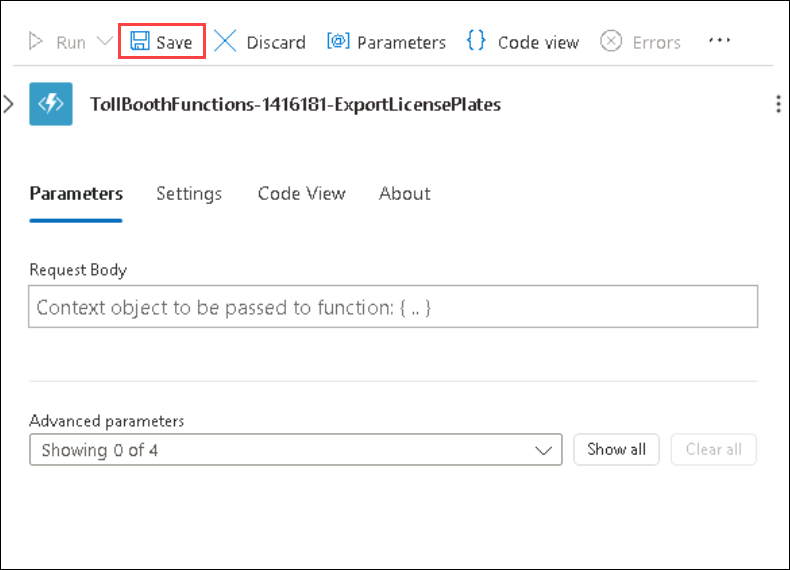

1. Select **+** marker and select **Add an action**.

   

1. search for `condition` **(1)**. Select the **Condition****(2)** Control option from the Actions search result.

   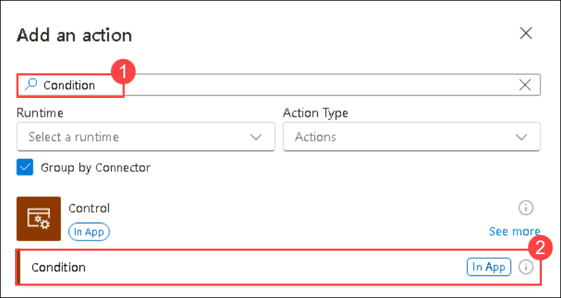

1. On the **Condition** pane, select **choose value** box and click on the symbol which represents the function app as shown.

   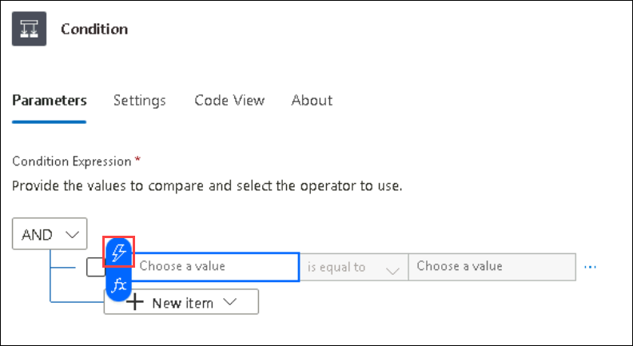

1. Scroll down and choose the **Status code** option.

   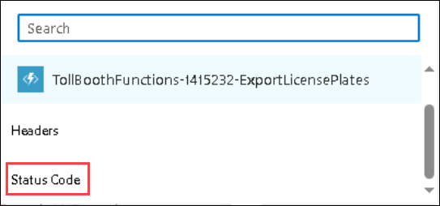

1. On the **Condition** page, make sure the condition is set to **is equal to** and set the value as **200** and save it.

   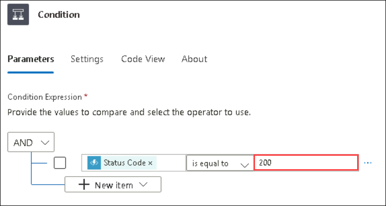

   > **Note**: This evaluates the status code returned from the ExportLicensePlates function, which will return a 200 code when license plates are found and exported. Otherwise, it sends a 204 (NoContent) status code when no license plates were discovered that need to be exported. We will conditionally send an email if any response other than 200 is returned.

1. We will ignore the If true condition because we don't want to perform an action if the license plates are successfully exported. Select **+** marker and click on **Add an action** within the **If false** condition block.

   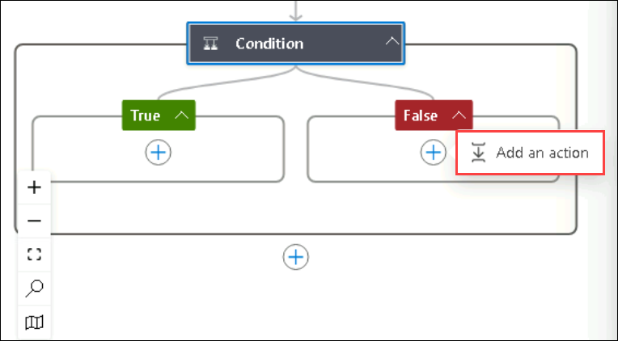

1. Enter `Send an email (V2)` **(1)** in the filter box, then select the **Send an email (V2)** **(2)** action for Office 365 Outlook.

   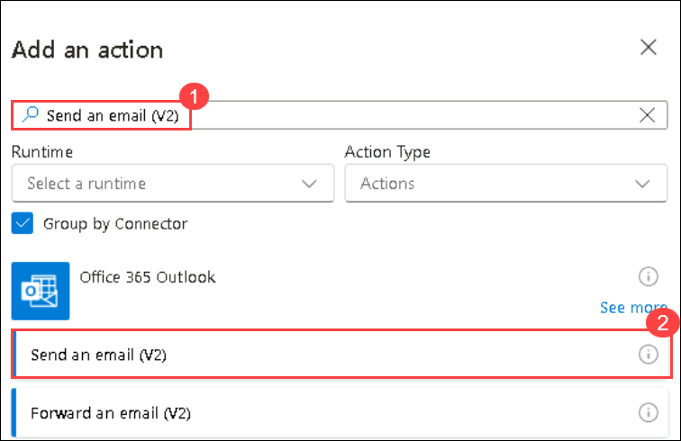

1. Select **Sign in** and sign in to your Office 365 Outlook account.

   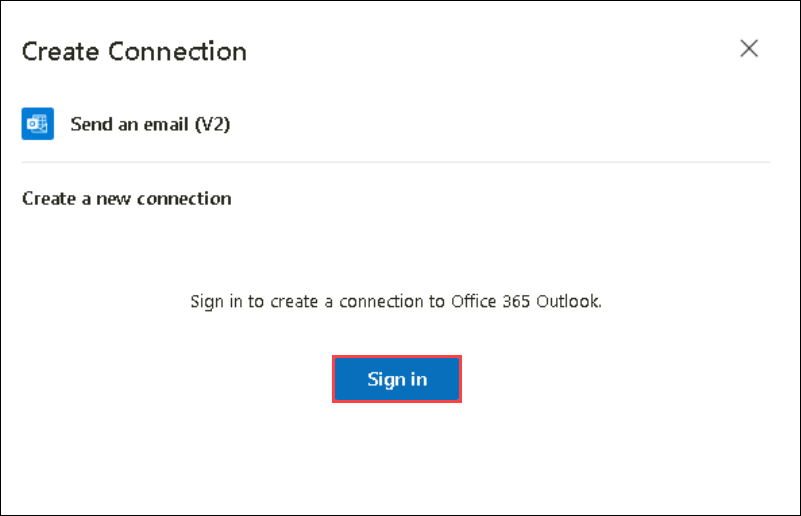

1. You will get a pop up window to **pick an account**. select your account and complete sign in process.

   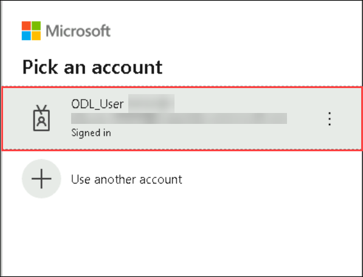

1. In the Send an email form, provide the following values:

   - Enter email address as **<inject key="AzureAdUserEmail" />** in the **To** **(1)** box.
   - Provide a **Subject** **(2)**, such as `Toll Booth license plate export failed`.

   

1. In the **Body** box, select the box and click on the symbol which represents function app as shown.

   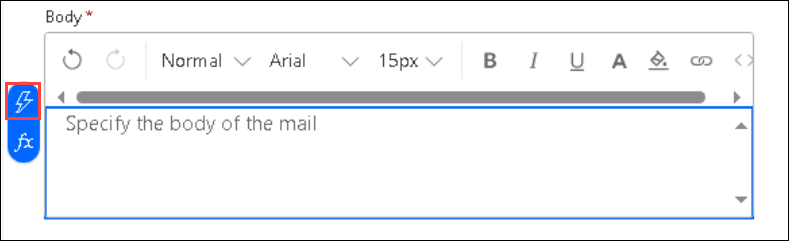

1. In the pop up window select **Status code** option.

   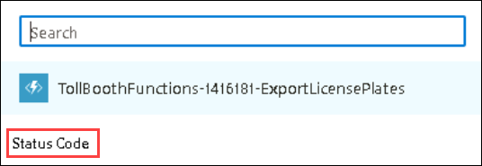

   >**Note**: In this example only status code is added here in the body. But You can add any message in the body such as **No Data Found**. 

1. Select **Save** in the toolbar to save your Logic App.

   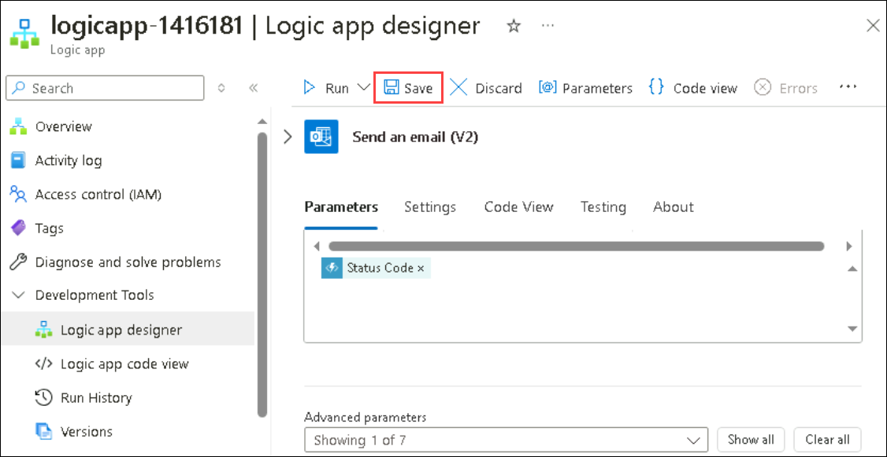

1. Select **Run** and click on **Run** to execute the Logic App. 

   

   >**Note**: Now your logic app will be executed and as you have data inside cosmosDB it will export your data into blob storage.

## Task 3: Verify the data export workflow

In this task you will verify that the data is exported to the blob or not. and also you will verify that you are getting the email if there is no data to export.

1. In the [Azure portal](https://portal.azure.com), navigate to the **hands-on-lab-<inject key="DeploymentID" enableCopy="false" />** resource group.

1. On your resource group blade, select the **datalake<inject key="DeploymentID" enableCopy="false" />** storage account from the list.

1. On the storage account menu, select the **containers** **(1)** which is under Data storage. Click on **export** **(2)** container.

   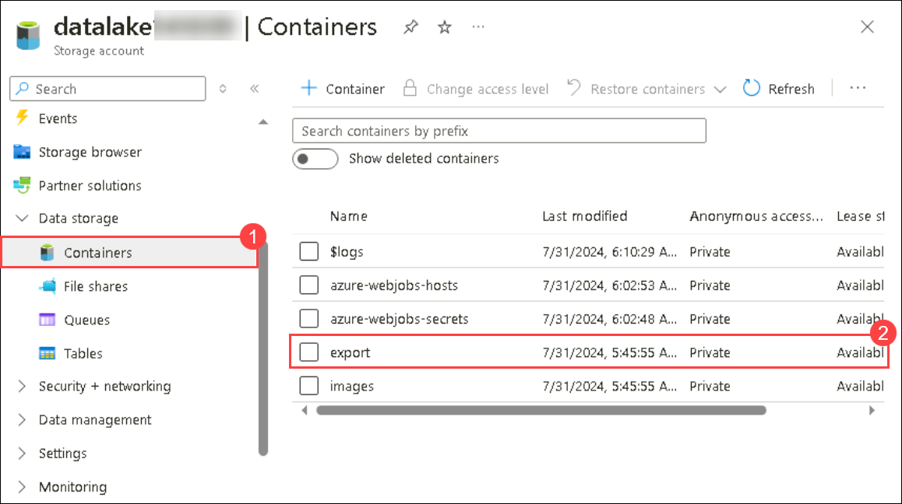

1. Inside that conatiner you can see a file which is in the `.csv` format. This is the file which contains all the processed license plate data which is exported through your logic app.

   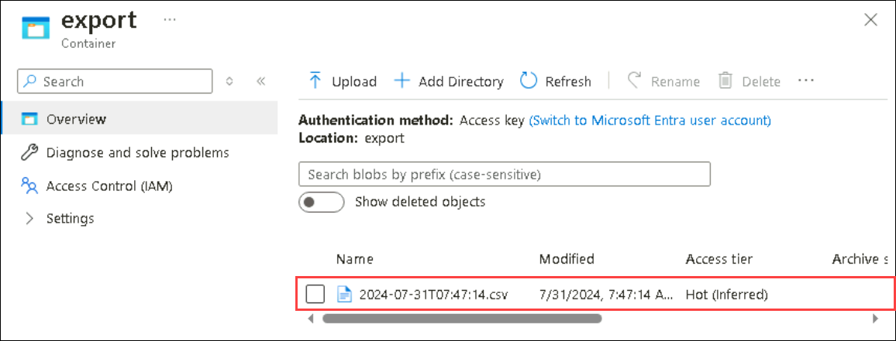

   >**Note**: You have successfully exported the data to blob storage. Now as there is no new data updated in your CosmosDB, you can verify that you are getting the email as **Toll Booth license plate export failed**.

1. Navigate back to **logicapp-<inject key="DeploymentID" enableCopy="false" />** and run it again.

   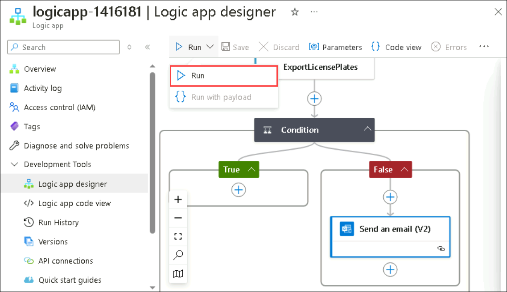

1. To verify that you are getting email alerts, you have to login for outlook. Use the link to login [Outlook Login](https://login.live.com/login.srf?wa=wsignin1.0&rpsnv=157&ct=1722420072&rver=7.0.6738.0&wp=MBI_SSL&wreply=https%3a%2f%2foutlook.live.com%2fowa%2f%3fnlp%3d1%26cobrandid%3dab0455a0-8d03-46b9-b18b-df2f57b9e44c%26culture%3den-us%26country%3dus%26RpsCsrfState%3d6d6ab2de-6ea5-2b12-26f1-cbb3946635b3&id=292841&aadredir=1&CBCXT=out&lw=1&fl=dob%2cflname%2cwld&cobrandid=ab0455a0-8d03-46b9-b18b-df2f57b9e44c)

1. You'll see **Sign in to outlook** page. use your credentials to login.

   - **Email/Username:** <inject key="AzureAdUserEmail"></inject>

   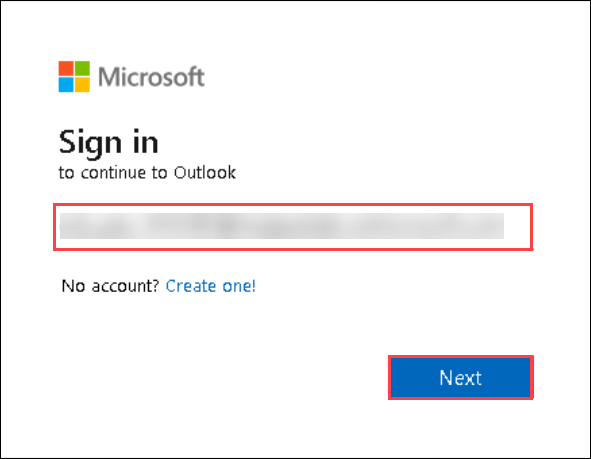

   - **Password:** <inject key="AzureAdUserPassword"></inject>

   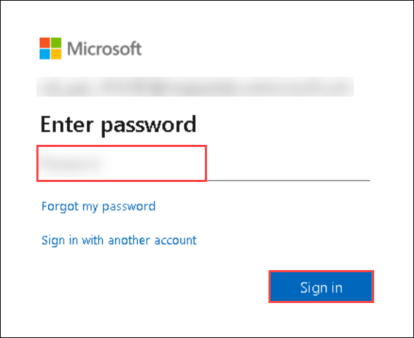

1. In the Inbox of your outlook you can see a mail with the subject **Toll Booth license plate export failed**. which says **204** means **No Content Found**.

   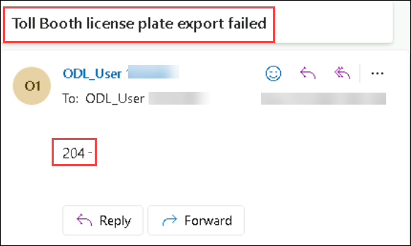

  > **Congratulations** on completing the task! Now, it's time to validate it. Here are the steps:
	
  - Hit the Validate button for the corresponding task. If you receive a success message, you can proceed to the next task. 
  - If not, carefully read the error message and retry the step, following the instructions in the lab guide.
  - If you need any assistance, please contact us at labs-support@spektrasystems.com. We are available 24/7 to help you out.

   <validation step="d7176d38-8645-4547-961a-b13dc8d88baf" />

## Summary

In this exercise, you have created a logic app automation where it runs for every 15 minutes and export data to storage. If there is no data to export, then sends an email to customer service.

## You have successfully completed the Lab!
