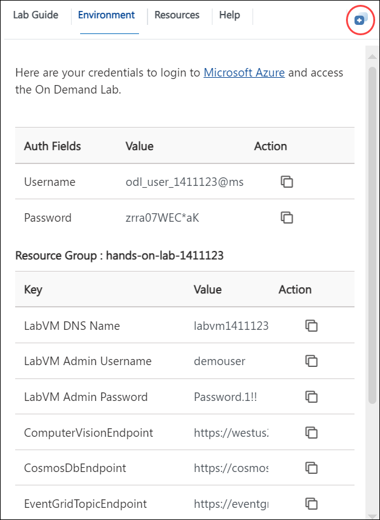

## **Getting Started with Serverless Architecture Hands-on lab**
 
Welcome to your Serverless Architecture Hands-on lab! We've prepared a seamless environment for you to explore and learn about Azure services. Let's begin by making the most of this experience:

# Serverless architecture hands-on lab step-by-step

## Abstract and learning objectives

In this hands-on lab, you implement an end-to-end solution using a supplied sample based on Microsoft Azure Functions, Azure Cosmos DB, Azure Event Grid, and related services. The scenario will include implementing compute, storage, workflows, and monitoring using various components of Microsoft Azure. You can implement the hands-on lab on your own. However, it is highly recommended to pair up with other members at the lab to model a real-world experience and to allow each member to share their expertise for the overall solution.

At the end of the hands-on lab, you will have confidence in designing, developing, and monitoring a serverless solution that is resilient, scalable, and cost-effective.

## Overview

Contoso is rapidly expanding its toll booth management business to operate in a much larger area. As this is not their primary business, which is online payment services, they struggle with scaling up to meet the upcoming demand to extract license plate information from many new tollbooths, using photos of vehicles uploaded to cloud storage. Currently, they have a manual process where they send batches of images to a 3rd-party who manually transcodes the license plates to CSV files that they send back to Contoso to upload to their online processing system.

They want to automate this process in a way that is cost-effective and scalable. They believe serverless is the best route for them but do not have the expertise to build the solution.

## Solution architecture

Below is a diagram of the solution architecture you will build in this lab. Please study this carefully to understand the whole of the solution as you are working on the various components.

   

The solution begins with vehicle photos being uploaded to an **Azure Data Lake Storage Gen2** container as they are captured. An **Azure Event Grid** subscription is created against the data lake storage container. When a new blob is created, an event is triggered that calls the photo processing **Azure Function** endpoint, which in turn sends the photo to the **Computer Vision API** service to extract the license plate data. If processing is successful and the license plate number is returned. The function submits a new Event Grid event, along with the data, to an Event Grid topic with an event type called `savePlateData`. However, if the processing was unsuccessful, the function submits an Event Grid event to the topic with an event type called `queuePlateForManualCheckup`. Two separate functions are configured to trigger when new events are added to the Event Grid topic. Each filtering on a specific event type saves the relevant data to the appropriate **Azure Cosmos DB** collection for the outcome, using the Cosmos DB output binding. A **Logic App** that runs on a 15-minute interval executes an Azure Function via its HTTP trigger, responsible for obtaining new license plate data from Cosmos DB and exporting it to a new CSV file saved to Blob storage. If no new license plate records are found to export, the Logic App sends an email notification to the Customer Service department via their Office 365 subscription. **Application Insights** is used to monitor all Azure Functions in real-time as data is being processed through the serverless architecture. This real-time monitoring allows you to observe dynamic scaling first-hand and configure alerts when certain events take place. **Azure Key Vault** is used to securely store secrets, such as connection strings and access keys. Key Vault is accessed by the Function Apps through an access policy within Key Vault, assigned to each Function App's system-assigned managed identity.

Certainly. This architecture diagram illustrates a serverless solution for processing vehicle photos using various Azure services. Here's a breakdown of the workflow:

1. Data Input: Vehicle photos are captured and stored in Azure Blob Storage.

2. Event Triggering: Azure Event Grid detects new blob uploads and triggers Azure Functions.

3. Data Processing: 
   - One Azure Function extracts data from the photos and stores it in Cosmos DB.
   - Another Azure Function saves event data to Cosmos DB and sends a message to Service Bus.

4. Further Processing:
   - A third Azure Function is triggered by the Service Bus message, which processes the exported data and stores it in Azure Blob Storage.

5. Workflow Orchestration: Logic Apps create license plates for a particular time duration, likely based on the processed data.

6. API Management: An API Management (APM) instance is used to import OpenAPI definition and secure the API.

7. Computer Vision API: This is used for extracting license plate information from the photos.

8. Monitoring: Application Insights is integrated for monitoring and analytics of the entire system.

This architecture leverages serverless computing (Azure Functions) and event-driven design (Event Grid, Service Bus) to create a scalable, efficient system for processing vehicle photos, extracting license plate data, and managing the information flow through various Azure services.

## **Accessing Your Lab Environment**
 
Once you're ready to dive in, your virtual machine and **Lab Guide** will be right at your fingertips within your web browser.

   

### **Virtual Machine & Lab Guide**
 
Your virtual machine is your workhorse throughout the workshop. The lab guide is your roadmap to success.
 
## **Exploring Your Lab Resources**
 
To get a better understanding of your lab resources and credentials, navigate to the **Environment Details** tab.

   
 
## **Utilizing the Split Window Feature**
 
For convenience, you can open the lab guide in a separate window by selecting the **Split Window** button from the Top right corner.
 
   
 
## **Managing Your Virtual Machine**
 
Feel free to start, stop, or restart your virtual machine as needed from the **Resources** tab. Your experience is in your hands!
 
  
 
## **Let's Get Started with Azure Portal**
 
1. On your virtual machine, click on the Azure Portal icon as shown below:
 
    
 
2. You'll see the **Sign into Microsoft Azure** tab. Here, enter your credentials:
 
   - **Email/Username:** <inject key="AzureAdUserEmail"></inject>
 
        
 
3. Next, provide your password:
 
   - **Password:** <inject key="AzureAdUserPassword"></inject>
 
        
 
4. If you see the pop-up **Stay Signed in?**, click **No**.

    

5. If you see the pop-up **You have free Azure Advisor recommendations!**, close the window to continue the lab.

6. If a **Welcome to Microsoft Azure** popup window appears, click **Maybe Later** to skip the tour.
   
7. Now, click on the **Next** from the lower right corner to move to the next page.

    
 
Now you're all set to explore the powerful world of technology.
