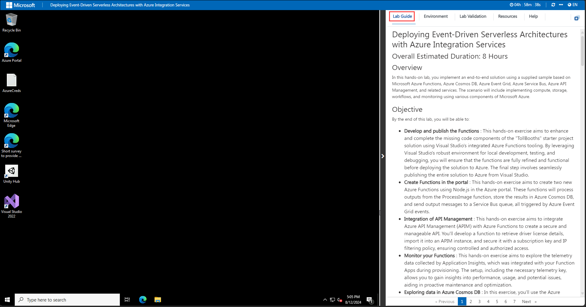
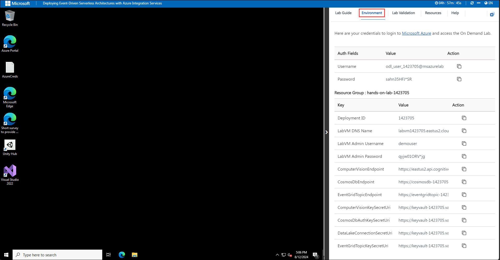
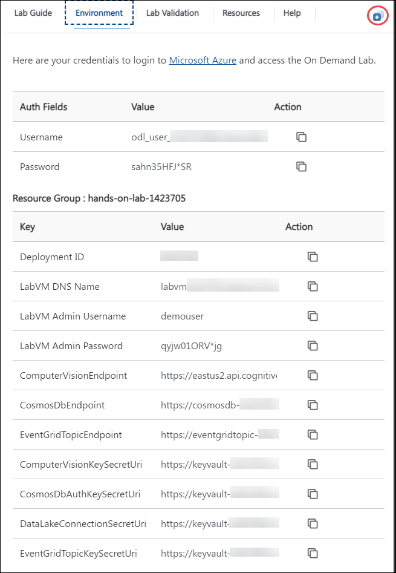
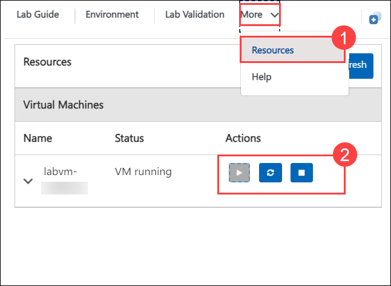
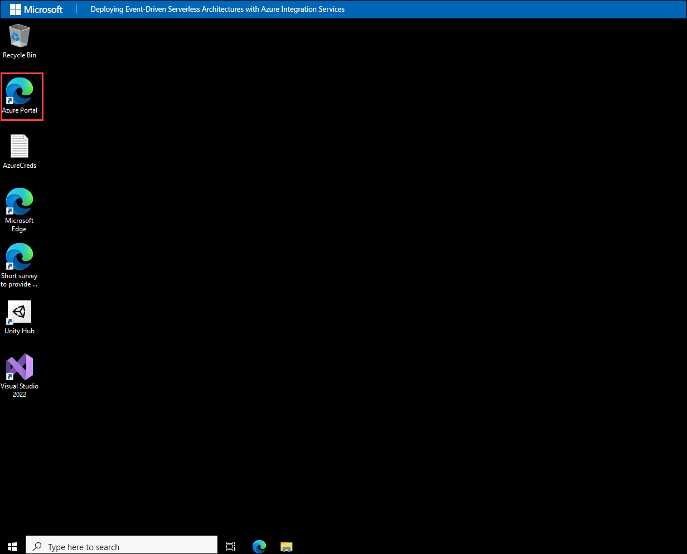

# Deploying Event-Driven Serverless Architectures with Azure Integration Services

## Overall Estimated Duration: 8 Hours

## Overview

In this hands-on lab, you implement an end-to-end solution using a supplied sample based on Microsoft Azure Functions, Azure Cosmos DB, Azure Event Grid, Azure Service Bus, Azure API Management, and related services. The scenario will include implementing compute, storage, workflows, and monitoring using various components of Microsoft Azure.

## Objective

By the end of this lab, you will be able to:

-  **Develop and publish the Functions** : This hands-on exercise aims to enhance and complete the missing code components of the "TollBooths" starter project solution using Visual Studio's integrated Azure Functions tooling. By leveraging Visual Studio's robust environment for local development, testing, and debugging, you will ensure that the functions are fully refined and functional before deploying the solution to Azure. The final step involves seamlessly publishing the entire solution to Azure from Visual Studio. 
- **Create Functions in the portal** : This hands-on exercise aims to create two new Azure Functions using Node.js in the Azure portal. These functions will process outputs from the ProcessImage function, store the results in Azure Cosmos DB, and send output messages to a Service Bus queue, all triggered by Azure Event Grid events.
- **Integration of API Management** : This hands-on exercise aims to integrate Azure API Management (APIM) with Azure Functions to create a secure and manageable API. You'll develop a function to retrieve driver license details, import it into an APIM instance, and secure it with a subscription key and IP filtering policy, ensuring controlled and authorized access.
- **Monitor your Functions** : This hands-on exercise aims to explore the telemetry data collected by Application Insights, which was integrated with your Function Apps during provisioning. The setup, including the necessary telemetry key, allows you to gain insights into performance, usage, and potential issues, aiding in proactive maintenance and optimization.
- **Exploring data in Azure Cosmos DB** : In this exercise, you'll use the Azure Cosmos DB Data Explorer in the portal to explore both processed and unprocessed license plate data. You'll run queries to retrieve specific data, gaining hands-on experience in navigating and managing your Cosmos DB collections for efficient data analysis.
- **Create the data export workflow** : This hands-on exercise aims to develop a new Logic App to automate the data export workflow. The Logic App will run on a schedule, calling the ExportLicensePlates function to retrieve license plate data. It includes a conditional step that sends an email notification if no records are found, ensuring your team stays informed and streamlining communication and operational efficiency.

## Pre-requisites
- **Fundamental Knowledge of Azure Services** : Knowing about some of the basics services like Functions, CosmosDB etc. 
- **Programming Skills**: Familiarity with Node JS, C# or similar languages

## Architecture

The solution begins with vehicle photos being uploaded to an Azure Data Lake Storage Gen2 container as they are captured. An Azure Event Grid subscription is created against the data lake storage container. When a new blob is created, an event is triggered that calls the photo processing Azure Function endpoint, which in turn sends the photo to the Computer Vision API service to extract the license plate data. If processing is successful and the license plate number is returned. The function submits a new Event Grid event, along with the data, to an Event Grid topic with an event type called savePlateData. However, if the processing was unsuccessful, the function submits an Event Grid event to the topic with an event type called queuePlateForManualCheckup. Two separate functions are configured to trigger when new events are added to the Event Grid topic. Each filtering on a specific event type saves the relevant data to the appropriate Azure Cosmos DB collection for the outcome, using the Cosmos DB output binding. Another Azure Function saves event data to Cosmos DB and sends a message to Service Bus. Also, Azure APIs are integrated with Azure function to  retrive processed data from cosmosDB by just using ID of the license plates.

A Logic App that runs on a 15-minute interval executes an Azure Function via its HTTP trigger, responsible for obtaining new license plate data from Cosmos DB and exporting it to a new CSV file saved to Blob storage. If no new license plate records are found to export, the Logic App sends an email notification to the Customer Service department via their Office 365 subscription. Application Insights is used to monitor all Azure Functions in real-time as data is being processed through the serverless architecture. This real-time monitoring allows you to observe dynamic scaling first-hand and configure alerts when certain events take place. Azure Key Vault is used to securely store secrets, such as connection strings and access keys. Key Vault is accessed by the Function Apps through an access policy within Key Vault, assigned to each Function App's system-assigned managed identity.

This architecture leverages serverless computing (Azure Functions) and event-driven design (Event Grid, Service Bus) to create a scalable, efficient system for processing vehicle photos, extracting license plate data, and managing the information flow through various Azure services.

## Architecture Diagram

   

## Explanation of Components

- **Azure Blob** : Azure Blob Storage is a scalable cloud storage service for storing large amounts of unstructured data, such as text or binary data
- **Azure Functions** : Azure Functions is a serverless compute service that enables you to run event-driven code without managing infrastructure. 
- **Azure Event Grid** : Azure Event Grid is a fully managed event routing service that allows for the building of reactive, event-driven applications.
- **Cosmos DB** : Azure Cosmos DB is a globally distributed database service that provides fast and scalable data storage with low latency. 
- **Azure Service Bus** : Azure Service Bus is a fully managed messaging service that enables reliable communication between distributed applications and services.
- **API Management Service** : Azure API Management is a fully managed service that enables you to create, publish, secure, and analyze APIs.
- **Azure Logic Apps** : Azure Logic Apps is a cloud service that allows you to automate workflows and integrate apps, data, and services. It enables you to design and execute workflows with minimal code using a visual designer, connecting various services and triggering actions based on events.

# Getting Started with Deploying Event-Driven Serverless Architectures with Azure Integration Services 

Welcome to your Deploying Event-Driven Serverless Architectures with Azure Integration Services, We've prepared a seamless environment for you to explore and learn about Azure services. Let's begin by making the most of this experience:

## Accessing Your Lab Environment

Once you're ready to dive in, your virtual machine and lab guide will be right at your fingertips within your web browser.
 

### Virtual Machine & Lab Guide
 
Your virtual machine is your workhorse throughout the workshop. The lab guide is your roadmap to success.
 
## Exploring Your Lab Resources
 
To get a better understanding of your lab resources and credentials, navigate to the **Environment** tab.
 

## Utilizing the Split Window Feature
 
For convenience, you can open the lab guide in a separate window by selecting the **Split Window** button from the Top right corner.
 
   
 
## Managing Your Virtual Machine
 
Feel free to start, stop, or restart your virtual machine as needed from the **Resources** tab. Your experience is in your hands!
 

 
## Let's Get Started with Azure Portal
 
1. On your virtual machine, double click on the Azure Portal icon as shown below:
 
    

2. You'll see the **Sign into Microsoft Azure** tab. Here, enter your credentials:
 
   - **Email/Username:** <inject key="AzureAdUserEmail"></inject>
 
    

3. Next, provide your password:
 
   - **Password:** <inject key="AzureAdUserPassword"></inject>
 
   

4. If prompted to **Action Required** tab, you can click **Ask later**.
 
5. If prompted to stay signed in, you can click **No**.
 
6. If a **Welcome to Microsoft Azure** pop-up window appears, simply click **Cancel** to skip the tour.
 
7. Click **Next** from the bottom right corner to embark on your Lab journey!
 
     
 
Now you're all set to explore the powerful world of technology. Feel free to reach out if you have any questions along the way. Enjoy your workshop!

## Support Contact
The CloudLabs support team is available 24/7, 365 days a year, via email and live chat to ensure seamless assistance at any time. We offer dedicated support channels tailored specifically for both learners and instructors, ensuring that all your needs are promptly and efficiently addressed.

Learner Support Contacts:

- Email Support: labs-support@spektrasystems.com
- Live Chat Support: https://cloudlabs.ai/labs-support

## Happy Learning!!
