# Exercise 2: Create Event driven Architecture Functions in the portal

**Estimated Duration**: 45 minutes

Here you will be using multiple services such as Azure Functions enables you to run event-driven code in a serverless environment. Azure Cosmos DB, a globally distributed, highly scalable database that ensures low latency and high availability. Additionally, Azure Service Bus provides a reliable messaging system.

In this exercise, you'll create two new Azure Functions using Node.js within the Azure portal. These functions will be designed to respond to events triggered by Azure Event Grid. Their primary role will be to process the output from the ProcessImage function, which analyzes license plate data. Once processed, the functions will store the results in Azure Cosmos DB and also create a output message and store those in service bus queue, ensuring efficient and scalable data management.

## Lab objectives

You will be able to complete the following tasks:

- Task 1: Create a function to save license plate data to Azure Cosmos DB
- Task 2: Add an Event Grid subscription to the SavePlateData function
- Task 3: Add an Azure Cosmos DB output to the SavePlateData function
- Task 4: Create a function to save manual verification info to Azure Cosmos DB
- Task 5: Add an Event Grid subscription to the QueuePlateForManualCheckup function
- Task 6: Add an Azure Cosmos DB output to the QueuePlateForManualCheckup function
- Task 7: Add Service Bus output binding to SavePlateData function
- Task 8: Test the Serverless Architecture

### Help references

|                  |          |
| ---------------- | -------- |
| **Description**  | **Link** |
| Create your first function in the Azure portal | <https://docs.microsoft.com/en-us/azure/azure-functions/functions-create-function-app-portal> |
| Store unstructured data using Azure Functions and Azure Cosmos DB | <https://docs.microsoft.com/azure/azure-functions/functions-integrate-store-unstructured-data-cosmosdb> |

## Task 1: Create a function to save license plate data to Azure Cosmos DB

In this task, you will create a new Node.js function triggered by Event Grid that outputs successfully processed license plate data to Azure Cosmos DB.

1. From Azure portal, Open the **hands-on-lab-<inject key="DeploymentID" enableCopy="false" />** resource group and select the Azure Function App whose name begins with **TollBoothEvents**.

   

1. Scroll down to **Functions** , then select **Create Function**.

    

1. On the **Create function** form, under **Select a template** tab:

   - Search for  **event grid**
   - Select the **Azure Event Grid trigger** template.
   - Select the **Next** button.

    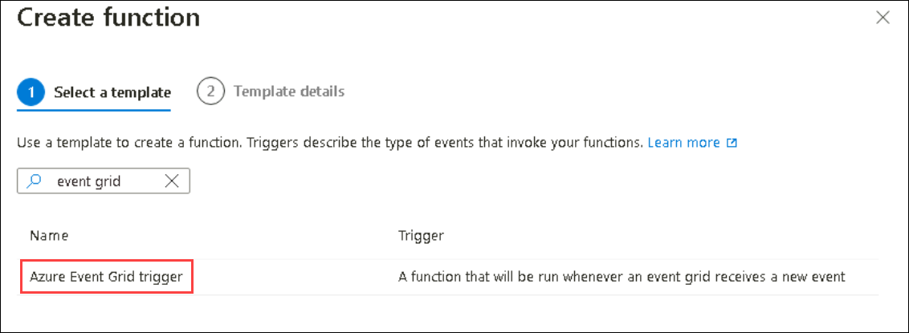

1. On the **Create function** form, under **Template details** tab Enter `SavePlateData` (1) into the **Function name** field, then Click on **Create** (2)

    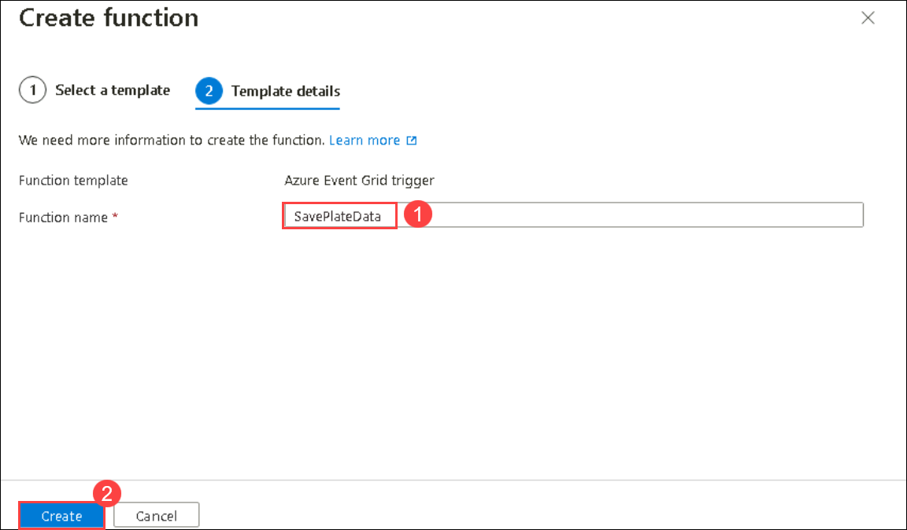

  > **Congratulations** on completing the task! Now, it's time to validate it. Here are the steps:
	
  - Hit the Validate button for the corresponding task. If you receive a success message, you can proceed to the next task. 
  - If not, carefully read the error message and retry the step, following the instructions in the lab guide.
  - If you need any assistance, please contact us at labs-support@spektrasystems.com. We are available 24/7 to help you out.

   <validation step="d1732963-931e-4ac4-bce6-49b2e526e153" />

## Task 2: Add an Event Grid subscription to the SavePlateData function

In this task, you will add an Event Grid subscription to the SavePlateData function. This will ensure that the events sent to the Event Grid topic containing the savePlateData event type are routed to this function.

1. With the SavePlateData function open, navigate to **Integration** (1) tab, then click on **Event Grid Trigger (eventGridEvent)** (2).

    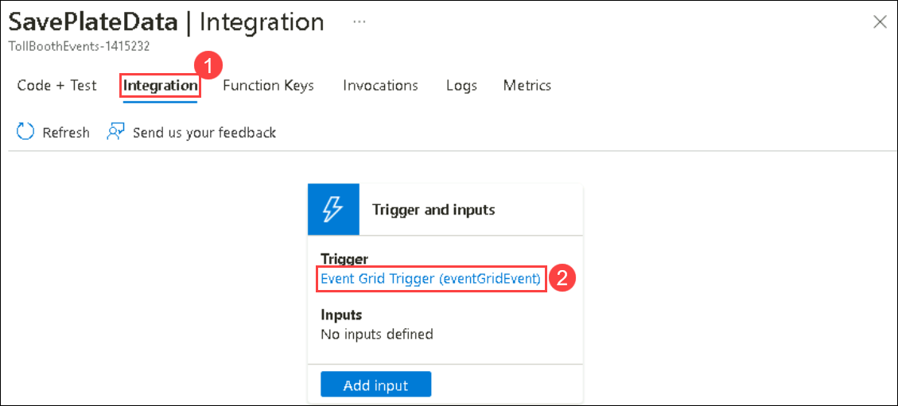

1. On the Edit Trigger form, select **Create Event Grid subscription**.

    

1. On the **Create Event Subscription** blade, specify the following configuration options and click on **Create** **(6)**

    - **Name**: Enter a unique value, similar to **saveplatedatasub** **(1)** (ensure the green checkmark appears).
    - **Event Schema**: Select **Event Grid Schema** **(2)**.
    - **Topic Type**: Select **Event Grid Topics** **(3)**.
    - **Subscription**: Select the subscription you are using for this hands-on lab.
    - **Resource Group**: Select the **hands-on-lab-<inject key="DeploymentID" enableCopy="false" />** resource group from the list of existing resource groups.
    - **Resource**: Select your Event Grid Topic. This should be the only service listed and will start with **eventgridtopic-<inject key="DeploymentID" enableCopy="false" />**.
    - **Event Types**: Select **Add Event Type** and enter **savePlateData** **(4)** for the new event type value. This will ensure this Event Grid type only triggers this function.
    - **Endpoint Type**: Leave **Azure Function** **(5)** as the Endpoint Type.
    - **Endpoint**: Leave as **SavePlateData**.

    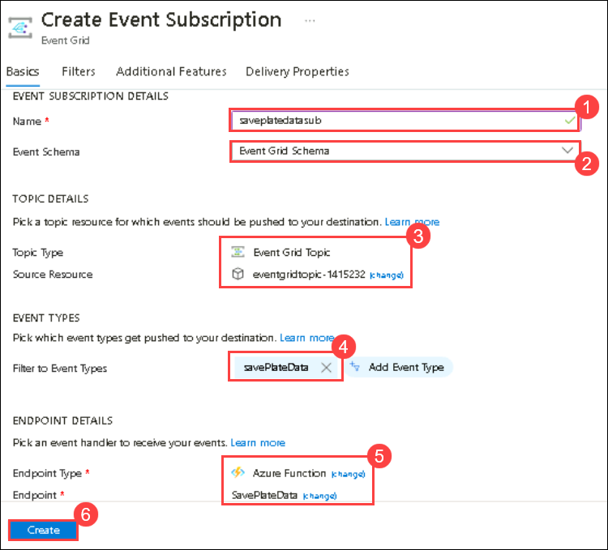


  > **Congratulations** on completing the task! Now, it's time to validate it. Here are the steps:
	
  - Hit the Validate button for the corresponding task. If you receive a success message, you can proceed to the next task. 
  - If not, carefully read the error message and retry the step, following the instructions in the lab guide.
  - If you need any assistance, please contact us at labs-support@spektrasystems.com. We are available 24/7 to help you out.

   <validation step="326ebf95-2c8a-4b80-b0d5-d8df85c05db7" />

## Task 3: Add an Azure Cosmos DB output to the SavePlateData function

In this task, you will add an Azure Cosmos DB output binding to the SavePlateData function, enabling it to save its data to the Processed collection.

1. While still on the **SavePlateData** Integration blade, select **+ Add output** under `Outputs`.

1. In the **Create Output** blade:

   - Select the `Azure Cosmos DB` for **Binding Type** (1).
   - Beneath the Cosmos DB account connection drop down, select the **New** link (2).
   - Choose the connection whose name begins with `cosmosdb-` (3).  
   - Select **OK** (4).

    

1. Specify the following additional configuration options in the Create Output form:

    - **Document parameter name**: Leave set to `outputDocument` **(1)**.
    - **Database name**: Enter `LicensePlates` **(2)**.
    - **Collection name**: Enter `Processed` **(3)**.
    - Click on **Add** **(4)**.

    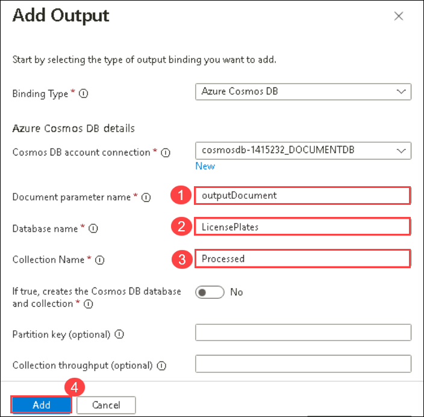

1. Close the `SavePlateData` function.

## Task 4: Create a function to save manual verification info to Azure Cosmos DB

In this task, you will create another new function triggered by Event Grid and outputs information about photos that need to be manually verified to Azure Cosmos DB.  

1. From Azure portal, Open the **hands-on-lab-<inject key="DeploymentID" enableCopy="false" />** resource group and select the Azure Function App whose name begins with **TollBoothEvents**.

   

1. Scroll down to **Functions** tab, then select **+ Create**.

    

1. On the **Create function** form, under **Select a template** tab:

   - Search for **event grid**.
   - Select the **Azure Event Grid trigger** template.
   - Select **next**.

    

1. On the **Create function** form, under **Template details** tab Enter `QueuePlateForManualCheckup` (1) into the **Function name** field, then Click on **Create** (2)

    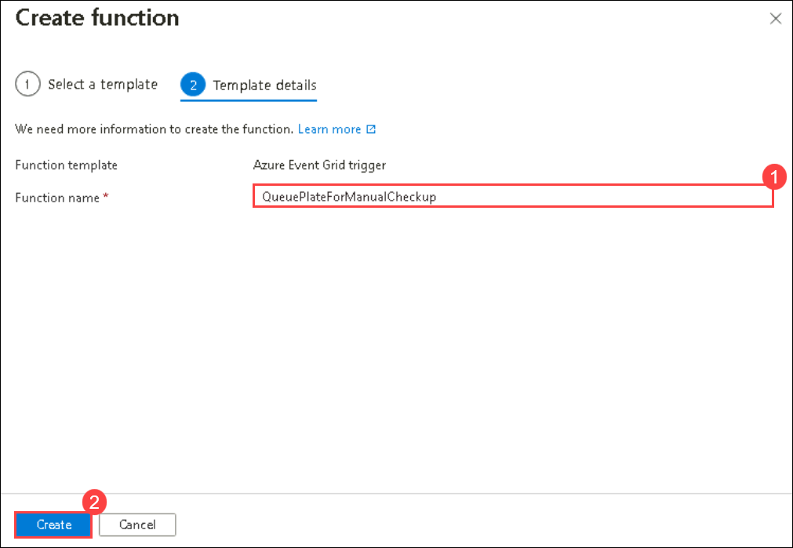

1. On the **QueuePlateForManualCheckup** Function blade, select **Code + Test** from the left-hand menu and replace the code in the new `QueuePlateForManualCheckup` function's `index.js` file with the following:

    ```javascript
    const { CosmosClient } = require('@azure/cosmos');

    module.exports = async function (context, eventGridEvent) {
        context.log(typeof eventGridEvent);
        context.log(eventGridEvent);

        // Create the output document for Cosmos DB
        const outputDocument = {
            id: eventGridEvent.id,
            fileName: eventGridEvent.data['fileName'],
            licensePlateText: eventGridEvent.data['licensePlateText'],
            timeStamp: eventGridEvent.data['timeStamp'],
            exported: false
        };

        // Retrieve the Cosmos DB connection string from environment variables
        const cosmosConnectionString = process.env['cosmosdb-<DEPLOYMENT-ID>_DOCUMENTDB'];
        
        // Specify the database and container names
        const databaseName = 'LicensePlates';
        const containerName = 'NeedsManualReview';

        // Initialize the CosmosClient
        const cosmosClient = new CosmosClient(cosmosConnectionString);
        const container = cosmosClient.database(databaseName).container(containerName);

        try {
            const { resource: createdItem } = await container.items.create(outputDocument);
            context.log(`Document created with id: ${createdItem.id}`);
        } catch (error) {
            context.log.error(`Error creating document: ${error.message}`);
        }
    };

    ```
1. In line 17, replace `<DEPLOYMENT-ID>` with **<inject key="DeploymentID" enableCopy="false" />**.

    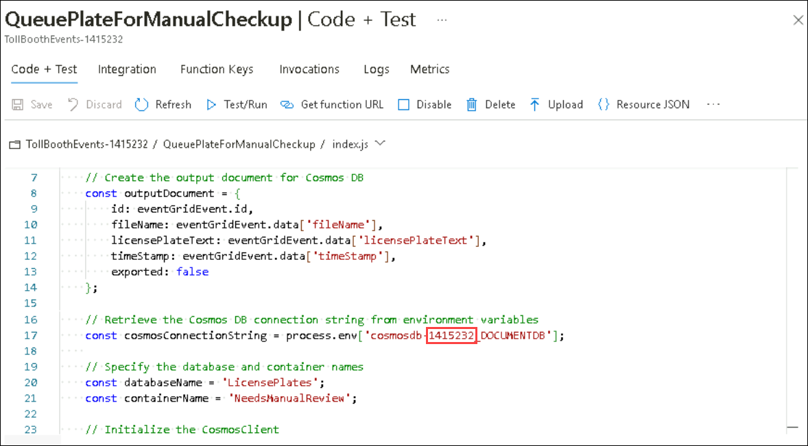

1. Select **Save**.

  > **Congratulations** on completing the task! Now, it's time to validate it. Here are the steps:
	
  - Hit the Validate button for the corresponding task. If you receive a success message, you can proceed to the next task. 
  - If not, carefully read the error message and retry the step, following the instructions in the lab guide.
  - If you need any assistance, please contact us at labs-support@spektrasystems.com. We are available 24/7 to help you out.

   <validation step="a268f259-fdbc-45fe-878c-b67fb5d8261e" />

## Task 5: Add an Event Grid subscription to the QueuePlateForManualCheckup function

In this task, you will add an Event Grid subscription to the QueuePlateForManualCheckup function. This will ensure that the events sent to the Event Grid topic containing the queuePlateForManualCheckup event type are routed to this function.

1. With the **QueuePlateForManualCheckup** function open, Navigate to **Integration** (1) tab. Select **Event Grid Trigger (eventGridEvent)** (2). 

    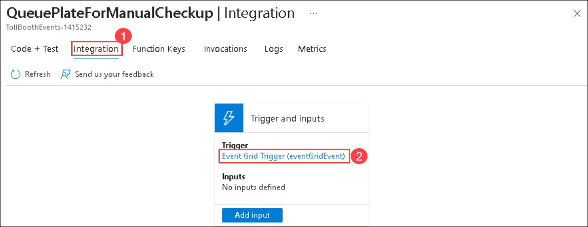

1. On the Edit Trigger form, select **Create Event Grid subscription**.

   

1. On the **Create Event Subscription** blade, specify the following configuration options and Select **Create** **(7)**.

    - **Name**: Enter a unique value, similar to **queueplateformanualcheckupsub** **(1)** (ensure the green check mark appears).
    - **Event Schema**: Select **Event Grid Schema** **(2)**.
    - **Topic Type**: Select **Event Grid Topics** **(3)**.
    - **Subscription**: Select the subscription you are using for this hands-on lab.
    - **Resource Group**: Select the **hands-on-lab-<inject key="DeploymentID" enableCopy="false" />** resource group from the list of existing resource groups.
    - **Resource**: Select your Event Grid Topic. This should be the only service listed and will start with **eventgridtopic-<inject key="DeploymentID" enableCopy="false" />** **(4)**.
    - **Event Types**: Select **Add Event Type** and enter **queuePlateForManualCheckup** **(5)** for the new event type value. This will ensure this function is only triggered by this Event Grid type.
    - **Endpoint Type**: Leave **Azure Function** **(6)** as the Endpoint Type.
    - **Endpoint**: Leave as **QueuePlateForManualCheckup** **(6)**.

    

1. close the Edit Trigger blade.

  > **Congratulations** on completing the task! Now, it's time to validate it. Here are the steps:
	
  - Hit the Validate button for the corresponding task. If you receive a success message, you can proceed to the next task. 
  - If not, carefully read the error message and retry the step, following the instructions in the lab guide.
  - If you need any assistance, please contact us at labs-support@spektrasystems.com. We are available 24/7 to help you out.

   <validation step="7a65ad8d-1425-4c4b-9a54-dcf23864322c" />

## Task 6: Add an Azure Cosmos DB output to the QueuePlateForManualCheckup function

In this task, you will add an Azure Cosmos DB output binding to the QueuePlateForManualCheckup function, enabling it to save its data to the NeedsManualReview collection.

1. While still on the **QueuePlateForManualCheckup** Integration blade, select **+ Add output** under **Outputs**.

1. In the **Create Output** form, select the following configuration options in the Create Output form:

    - **Binding Type**: Select `Azure Cosmos DB`.
    - **Cosmos DB account connection**: Select the **Azure Cosmos DB account connection** you created earlier.
    - **Document parameter name**: Leave set to `outputDocument`.
    - **Database name**: Enter `LicensePlates`.
    - **Collection name**: Enter `NeedsManualReview`.

1. Select **Add**.

    

1. Close the **QueuePlateForManualCheckup** function.

## Task 7: Add Service Bus output binding to SavePlateData function 

In this task, you'll bind the Service Bus to Azure Function App by adding connection string which is used in Index.js file of SavePlateData function.

1. From Azure portal, Open the **hands-on-lab-<inject key="DeploymentID" enableCopy="false" />** resource group and select the Azure Function App whose name begins with **ServiceBus-<inject key="DeploymentID" enableCopy="false" />**.

1. Select **Shared Access Policies (1)** from settings, click on **RootManageSharedAccessKey (2)**, copy the **Primary Connection String (3)** and paste it in a notepad. 

   

1. Navigate to home page  of **TollBoothEvents-<inject key="DeploymentID" enableCopy="false" />** function. Select **Environment variables (1)** and click on **+Add (2)** button.

   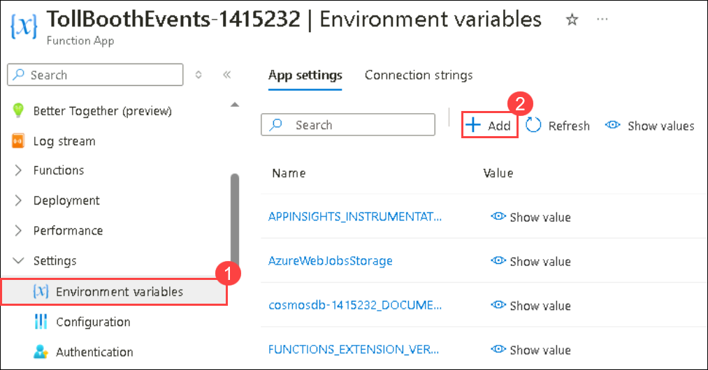

1. In the Add/Edit application setting tab, provide Name as **ServiceBusConnection** and paste the **Service Bus connection string (2)** which you copied in earlier step. Click on **Apply (3)** button to save. 

   

1. In App Settings tab, click on **Apply** and **Coinform**.

   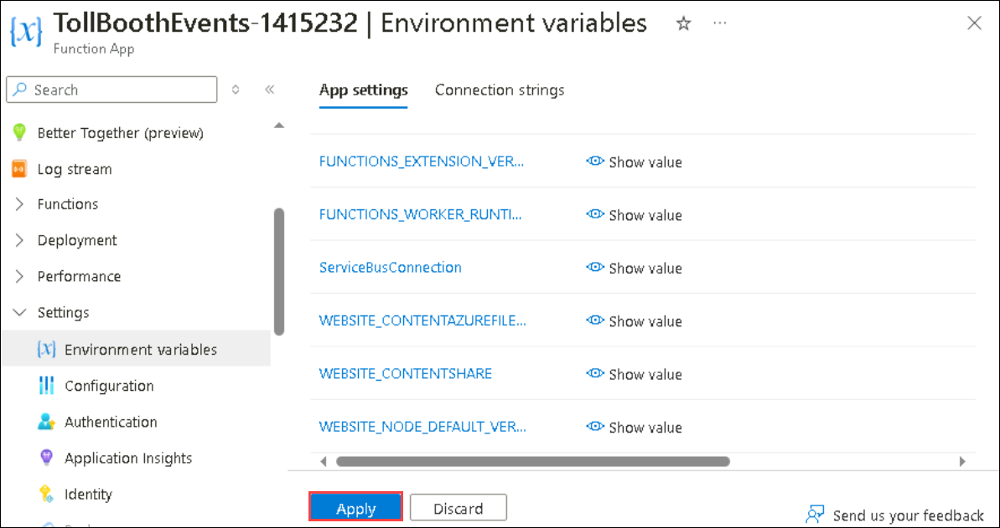

1. Now navigate to **SavePlateData** function which you have created previously.

1. On the **SavePlateData** Function blade, select **Code + Test** and replace the code in the `SavePlateData` function's `index.js` file with the following:

    ```javascript
    const { ServiceBusClient } = require('@azure/service-bus');
    const { CosmosClient } = require('@azure/cosmos');

    module.exports = async function (context, eventGridEvent) {
        context.log(typeof eventGridEvent);
        context.log(eventGridEvent);

        // Create the output document for Cosmos DB
        const outputDocument = {
            id: eventGridEvent.id,
            fileName: eventGridEvent.data['fileName'],
            licensePlateText: eventGridEvent.data['licensePlateText'],
            timeStamp: eventGridEvent.data['timeStamp'],
            exported: false
        };

        // Connect to Cosmos DB and add the document to the specified container
        const cosmosConnectionString = process.env['cosmosdb-<DEPLOYMENT-ID>_DOCUMENTDB'];
        const databaseName = 'LicensePlates';
        const containerName = 'Processed';
        const cosmosClient = new CosmosClient(cosmosConnectionString);
        const container = cosmosClient.database(databaseName).container(containerName);

        try {
            await container.items.create(outputDocument);
            context.log('Document successfully created in Cosmos DB');
        } catch (error) {
            context.log.error(`Error creating document in Cosmos DB: ${error.message}`);
            throw error;
        }

        // Create a message for the Service Bus queue
        const message = {
            body: outputDocument
        };

        // Connect to Service Bus and send the message
        const serviceBusConnectionString = process.env['ServiceBusConnection'];
        const queueName = 'processed';
        const sbClient = new ServiceBusClient(serviceBusConnectionString);
        const sender = sbClient.createSender(queueName);

        try {
            await sender.sendMessages(message);
            context.log('Message sent to Service Bus queue');
        } catch (error) {
            context.log.error(`Error sending message to Service Bus queue: ${error.message}`);
            throw error;
        } finally {
            await sender.close();
            await sbClient.close();
        }

        context.done();
    };
    ```
1. In line 18, replace `<DEPLOYMENT-ID>` with **<inject key="DeploymentID" enableCopy="false" />** **(1)** and click on **Save** **(2)**

   

1. From **TollBoothEvents-<inject key="DeploymentID" enableCopy="false" />** function, select **Developer Tools (1)** drop-down from the side blade and click on **Console (2)**.

   

1. In the console, run the below given commands. Make sure to run the commands one by one and wait till the execution completes.

   ```javascript
   npm install @azure/service-bus
   ```

   ```javascript
   npm install @azure/cosmos
   ```

   
   
   >**Note**: If you see any error related to `npm notice` you can ignore that.


## Task 8: Test the Serverless Architecture

In this task, you will debug the uploadImage solution and obaserve the working of serverless solution by just uploading the license plate images.

1. Navigate back  to the starter app solution in Visual Studio on the LabVM.

1. Navigate to the **UploadImages** project using the Solution Explorer of Visual Studio. Right-click on **UploadImages** project and select **Properties**.

    

1. Select **Debug** from the left-hand menu. In the **General** section, click on **Open debug launch profiles UI** to access the debug launch profiles interface.

   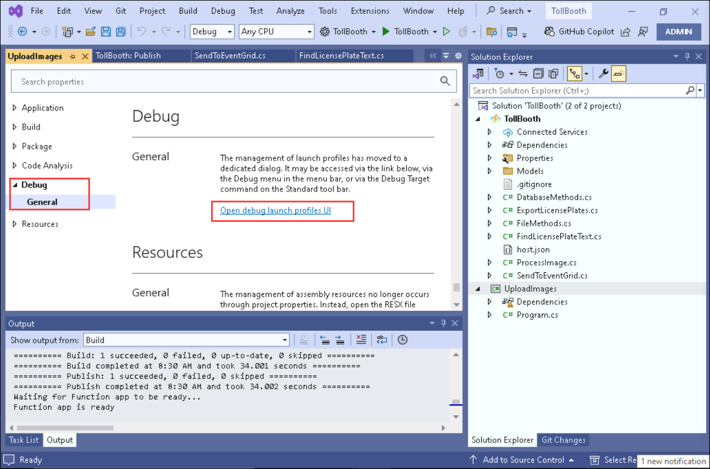

1. Paste the connection string for your Azure Data Lake Storage Gen2 account into the **Command line arguments** text field.

   > **Note**: To obtain the connection string:
   >
   > - In the Azure portal, navigate to the **datalake<inject key="DeploymentID" enableCopy="false" />** storage account.
   > - Select **Access keys** from the left menu under **Security + Networking**.
   > - Copy the **Connection string** value of **key1**.
   

   Providing this value will ensure that the required connection string is added as an argument each time you run the application. Additionally, the combination of adding the value here and having the `.gitignore` file included in the project directory will prevent the sensitive connection string from being added to your source code repository in a later step.

    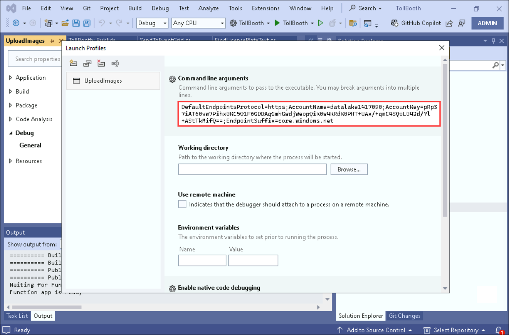

1. Save your changes by selecting the Save icon on the Visual Studio toolbar.

1. Right-click the **UploadImages** project in the Solution Explorer, select **Debug**, then **Start New Instance** from the context menu.

   

1. When the console window appears, enter **1** and press **ENTER**. This action uploads a handful of car photos to the images container of your Blob storage account.

    

1. Switch back to your browser window, navigate to **hands-on-lab-<inject key="DeploymentID" enableCopy="false" />**  and open  **cosmosdb-<inject key="DeploymentID" enableCopy="false" />**.

   

1. Select **Data Explorer (1)** from the side blade, expand **LicensePlates (2)** database. You'll be able to see 2 containers **NeedsManualReview** and **Processed** **(3)**.

    

1. Click on **items** and you should be able to see that processed data and unprocessed are updated. This validates that your serverless architecture is working as expected.

    

1. Also, navigate to **hands-on-lab-<inject key="DeploymentID" enableCopy="false" />**  and open  **ServiceBus-<inject key="DeploymentID" enableCopy="false" />**.

   

1. From the side-blade, select **Queues (2)** from the **Entities (1)** drop-down, and open **Processed (3)** queue.

   

1. Click on **Service Bus Explorer (1)** from the side blade. Select **Peek from start (2)** and you will see the queues craeted by function app.

   

## Summary

In this exercise, you added functions to TollBoothEvents-<inject key="DeploymentID" enableCopy="false" /> function. Also, you configured a service bus queue and integrated it with TollBoothIntegration-<inject key="DeploymentID" enableCopy="false" /> function.

## You have successfully completed the Lab!
